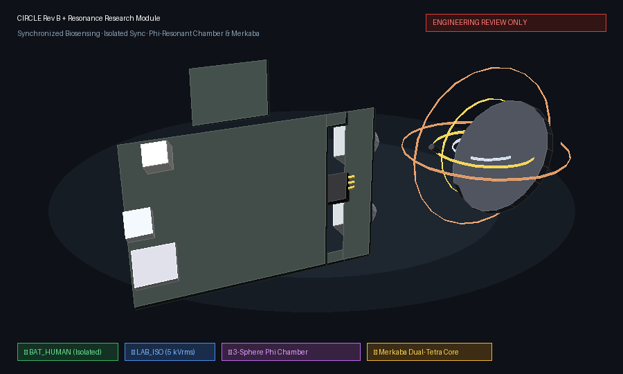
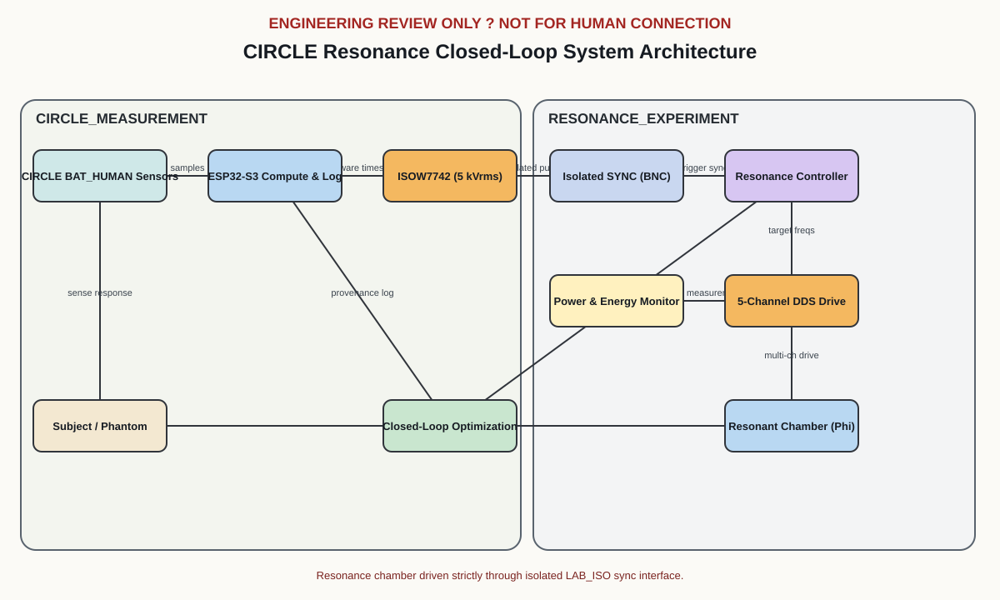
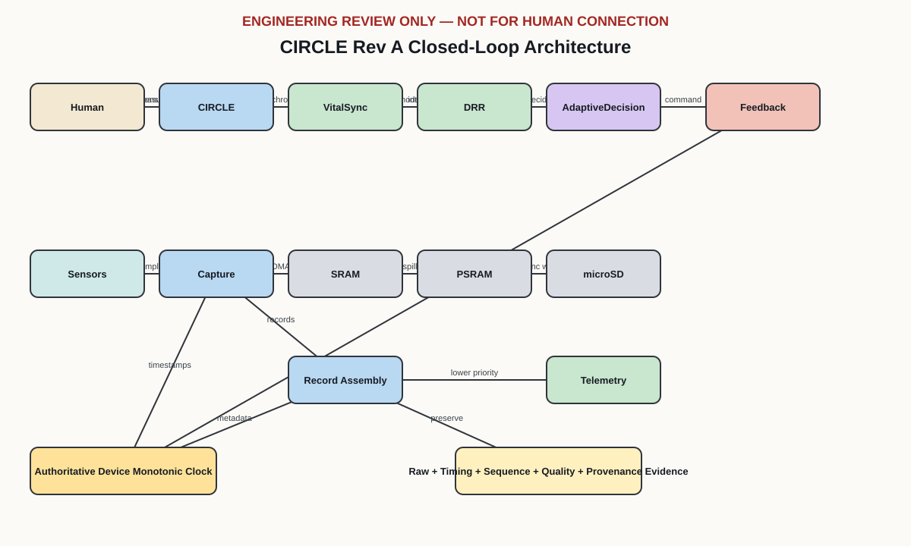
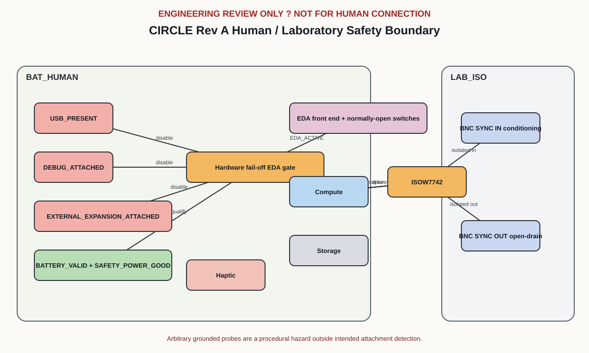

# CIRCLE

**Because a human state is rarely one signal.**

CIRCLE is an open-source biosignal research platform for exploring how physiological signals move together over time—and how closed-loop systems can sense, record, and respond to those changing patterns.

It combines synchronized physiological sensing, deterministic recording, isolated laboratory synchronization, and locally evidenced feedback within a single reviewable architecture.

> **ENGINEERING REVIEW ONLY** — Experimental research hardware. Not certified for clinical, medical, or human-connected use.

---

## What CIRCLE explores

Human physiology is inherently multimodal.

Attention, stress, emotion, arousal, movement, and awareness do not emerge from a single measurement. They arise from the changing relationships among many signals and conditions.

CIRCLE is designed to capture multiple dimensions of physiological activity within a shared timing and provenance model, providing an experimental foundation for studying relationships among physiological state, movement, context, and feedback.

The system combines:

- **EDA** for electrodermal activity
- **PPG** with preserved raw red and infrared optical measurements
- **IMU** motion capture
- **Deterministic timestamps**
- **Local microSD recording**
- **Haptic feedback**
- **Isolated laboratory synchronization**
- **Explicit data provenance**

The goal is not simply to collect signals.

It is to create an instrument capable of studying **how signals change together** while preserving enough evidence to ask what happened before, during, and after a feedback event.

---

## At a glance

| | |
| --- | --- |
| **Purpose** | Experimental biosignal architecture, safety contract, and schematic review |
| **Revision** | Rev B |
| **Hardware** | `circle-main` (85×55 mm, 4-layer) compute/acquisition board + replaceable `circle-ppg` (25×18 mm, 4-layer) optical board |
| **Electrical model** | Human-connected `BAT_HUMAN` domain separated from `LAB_ISO` through reinforced isolation (8.0 mm physical cutout slot, ISOW7742 5 kVrms barrier) |
| **Compute** | ESP32-S3-WROOM-1-N16R8 |
| **Storage** | Local microSD with 8 MB PSRAM-buffered asynchronous recording |
| **Toolchain** | Python 3.11+ and KiCad CLI 10.0.5 |
| **Status** | Repository verification passes; fabrication and human connection remain blocked |

**Review artifacts:**  
[3D animation](diagrams/circle-3d-animation.gif) ·
[interactive 3D viewer](diagrams/circle-3d-viewer.html) ·
[system architecture](diagrams/system-architecture.svg) ·
[safety analysis](docs/safety-analysis.md) ·
[resonance architecture](diagrams/resonance-architecture.svg) ·
[resonance safety](diagrams/resonance-safety-boundary.svg) ·
[resonance geometry](diagrams/resonance-geometry.svg) ·
[main schematic](hardware/reports/pdf/circle-main.pdf) ·
[optical schematic](hardware/reports/pdf/circle-ppg.pdf) ·
[review gates](docs/review-gates.md) ·
[verification summary](hardware/reports/verification-summary.json)

---

## CIRCLE Hardware & Resonance Platform



*3D turntable visualization of the CIRCLE Rev B architecture: `circle-main` (85×55 mm compute & biosignal acquisition board) with 8.0 mm reinforced isolation slot, `circle-ppg` (25×18 mm optical contact head), and the external **3-Sphere $\phi$-Resonance Chamber** with central **Merkaba (Dual-Tetrahedral) Core**.*

---

## Resonance Research Module

The **CIRCLE Resonance Module** provides a modular, evidence-before-inference experimental extension to investigate whether externally driven resonant fields, geometric proportions ($\phi \approx 1.6180339887$), and multi-frequency phase relationships produce reproducible changes in synchronized physiological and environmental sensor signals.

Instead of presupposing outcomes, CIRCLE formalizes the empirical question as a balanced hypothesis test:

$$H_0: R_\phi = R_\text{control} \quad \text{versus} \quad H_1: R_\phi \neq R_\text{control}$$

while systematically testing:
* **Geometry:** $\phi$-spaced ($D, D/\phi, D/\phi^2$) vs equal-spaced vs random spacing vs unpowered sham
* **Core:** Dual-interpenetrating tetrahedron (Merkaba) vs spherical core vs cubic core vs empty cavity
* **Drive:** Active multi-frequency drive vs matched $50\ \Omega$ sham dummy load
* **Discrimination:** Verified biological response vs electronic phantom instrumentation pickup (EMI/thermal drift)

### Key Architectural Invariants:
* **Symmetric Prior Physics:** Simulator gives all geometries identical prior coupling constants; non-linear harmonics and mode splitting emerge dynamically from coupled differential equations.
* **Unbiased Search & Adaptive Learning:** Default parameter search samples log-uniformly across the spectrum; closed-loop exploration updates Gaussian Process posteriors with Upper Confidence Bounds (GP-UCB).
* **Decoupled Opaque Blinding:** Trials use cryptographically random opaque tokens (`TRIAL-XXXXXXXX`) and sealed trial manifests.
* **Strict Electrical Isolation:** Zero conductive connection to `BAT_HUMAN`; synchronization interfaces exclusively across the 5.0 kVrms ISOW7742 `LAB_ISO` barrier.
* **Conservation of Energy:** Enforces $P_\text{out} \le P_\text{in}$ with thermal dissipation accounting.



---

## System architecture

### `circle-main`

The primary compute and acquisition board (85×55 mm, 4-layer, ENIG finish) combines:

- ESP32-S3 compute (16 MB flash, 8 MB PSRAM)
- Battery charging and power management (BQ24074 + TPS63070 buck-boost)
- Protected EDA acquisition (ADS1220 24-bit ADC, OPA2192 instrumentation, REF5020 reference)
- 6-axis IMU capture (ICM-42688-P)
- microSD storage (4-bit SDIO)
- Isolated synchronization (ISOW7742 reinforced digital isolator with integrated DC/DC)
- Haptic feedback (DRV2605L)
- System observability (MCP23017 I/O expander, 16 testpoints)

### `circle-ppg`

A keyed, replaceable optical contact board (25×18 mm, 4-layer) preserves raw red and infrared PPG measurements for downstream analysis.

- MAX30102 optical pulse oximeter sensor
- LP5907 ultra-low-noise 1.8V LDO
- TXS0102 I²C level translator
- AT24CS02 EEPROM with factory UID for board identification
- LIS2DW12 accelerometer (DNI in Rev B base build)

The acquisition path is designed around deterministic timing and explicit evidence:

```text
Sensors
   ↓
Timestamp capture
   ↓
SRAM / PSRAM buffering
   ↓
Record assembly + provenance
   ↓
Asynchronous microSD storage
   ↓
Derived telemetry/feedback
```



---

## The closed loop

CIRCLE is designed around a simple research loop:

```text
Human
  ↓
Physiological signals
  ↓
CIRCLE sensing
  ↓
Timestamped + provenance-aware records
  ↓
Model / adaptive decision
  ↓
Feedback
  ↓
Human
  ↓
Measurement
```

This makes feedback part of the experimental record rather than something occurring outside it.

**Sense. Record. Respond. Measure again.**

---

## Safety boundary

The architecture separates the human-connected `BAT_HUMAN` domain from the laboratory-facing `LAB_ISO` domain through a physical 8.0 mm no-copper cutout slot in the PCB and a TI ISOW7742 reinforced digital isolator (5.0 kVrms dielectric rating).

USB, debug, and external-expansion attachment are designed to force the hardware EDA path off. Isolated SYNC provides the intended interface between the two electrical domains.



Review the [architecture](docs/architecture.md) and [safety analysis](docs/safety-analysis.md) before inspecting or evaluating the schematics.

> Passing automated repository checks does **not** authorize fabrication, powered-electrode operation, or human connection.

---

## What "verified" means

The checked-in [verification summary](hardware/reports/verification-summary.json) records successful execution of the repository release checks.

In this repository, **verified** means that the engineering-review package is internally consistent and reproducible within the pinned toolchain.

It does **not** mean that the hardware has been validated for human use.

| Scope | Evidence | Status |
| --- | --- | --- |
| Repository contracts | Unit tests + manifest and schema validators | ✅ Checks pass |
| Generated artifacts | Diagrams and schematic packages regenerate deterministically | ✅ Checks pass |
| Schematic parsing / ERC | KiCad parses and ERC-checks both boards (0 violations) | ✅ Checks pass |
| PCB design rules | KiCad DRC (0 violations on both boards) | ✅ Checks pass |
| Safety / power / isolation / SI / footprints | Evidence defined in review gates | ⚠️ Open |
| Fabrication | Physical validation | ❌ Not validated |
| Powered electrodes / human use | Human-connected validation | ❌ Not validated |
| EMC / regulatory | Formal validation | ❌ Not validated |
| Measurement performance | Bench characterization | ❌ Not validated |

Passing the repository checks does **not** close a review gate or authorize fabrication or human connection.

---

## Quick start

The fast repository checks use only the Python standard library.

```bash
git clone https://github.com/topherchris420/circle.git
cd circle

python -m pytest
python tools/check_design_manifest.py
python tools/check_record_schema.py
```

These checks are platform-independent and do not require KiCad.

---

## Complete release verification

[`tools/verify_release.py`](tools/verify_release.py) runs the tests and validators, regenerates diagrams and schematics, invokes KiCad ERC for both boards, checks the ERC allowlist, and rewrites [`hardware/reports/verification-summary.json`](hardware/reports/verification-summary.json).

### Windows

The default KiCad location is:

```text
%USERPROFILE%\AppData\Local\Programs\KiCad\10.0\bin\kicad-cli.exe
```

Run:

```powershell
py -3.11 tools/verify_release.py
```

### POSIX

If KiCad is installed elsewhere, set `KICAD_CLI` explicitly:

```bash
KICAD_CLI=/usr/bin/kicad-cli python tools/verify_release.py
```

A successful run ends with:

```text
CIRCLE Rev B review package: VERIFIED
```

The full command rewrites generated artifacts and reports.

Run it from a clean worktree and inspect `git diff` afterward. Reproducible output should not introduce an unexplained difference.

---

## PCB regeneration

Both board layouts are generated deterministically from [`tools/build_clean_pcb.py`](tools/build_clean_pcb.py).

```bash
python tools/build_clean_pcb.py
```

This produces `hardware/circle-main/circle-main.kicad_pcb` and `hardware/circle-ppg/circle-ppg.kicad_pcb` with zero DRC violations under KiCad 10.0.5.

To re-export fabrication outputs (Gerbers, drill files, pick-and-place, STEP models):

```bash
kicad-cli pcb export gerbers -o hardware/reports/gerbers/circle-main/ hardware/circle-main/circle-main.kicad_pcb
kicad-cli pcb export drill   -o hardware/reports/gerbers/circle-main/ hardware/circle-main/circle-main.kicad_pcb
kicad-cli pcb export pos     -o hardware/reports/pos/circle-main-pos.csv hardware/circle-main/circle-main.kicad_pcb
kicad-cli pcb export step    -o hardware/reports/step/circle-main.step hardware/circle-main/circle-main.kicad_pcb
```

After regeneration, run `tools/verify_release.py` and `tools/generate_release_manifest.py` to update the verification summary and cryptographic manifest.

---

## Suggested review path

1. Read the [architecture](docs/architecture.md).
2. Inspect the [system diagram](diagrams/system-architecture.svg).
3. Review the [safety analysis](docs/safety-analysis.md) alongside the [safety-boundary diagram](diagrams/safety-boundaries.svg).
4. Inspect the rendered [main-board](hardware/reports/pdf/circle-main.pdf) and [optical-board](hardware/reports/pdf/circle-ppg.pdf) schematics.
5. Review every unresolved item in the [review gates](docs/review-gates.md).
6. Cross-check the [pin allocation](docs/pin-allocation.md), [power budget](docs/power-budget-analysis.md), and [timing/data model](docs/timing-and-data-model.md).
7. Evaluate the evidence required by the [validation plan](docs/validation-plan.md).
8. Run complete release verification and inspect the resulting [verification summary](hardware/reports/verification-summary.json).

---

## Repository map

| Path | Contents |
| --- | --- |
| [`contracts/`](contracts/) | Machine-readable session-record contracts |
| [`diagrams/`](diagrams/) | Architecture and safety-boundary diagrams (Mermaid source + rendered SVG) |
| [`docs/`](docs/) | Architecture, safety, timing, power, validation, and review documentation |
| [`hardware/design-manifest.json`](hardware/design-manifest.json) | Board hierarchy, nets, 95 parts, GPIO allocation, and unresolved gates |
| [`hardware/interfaces.json`](hardware/interfaces.json) | 11 connector definitions with electrical domains and EDA attachment policy |
| [`hardware/libraries/`](hardware/libraries/) | KiCad symbol library (23 ICs, 269 pins) and custom footprints |
| [`hardware/circle-main/`](hardware/circle-main/) | Main-board KiCad project (85×55 mm, 4-layer PCB + legacy schematics) |
| [`hardware/circle-ppg/`](hardware/circle-ppg/) | Optical-board KiCad project (25×18 mm, 4-layer PCB + legacy schematic) |
| [`hardware/reports/`](hardware/reports/) | DRC/ERC reports, BOMs, Gerbers, STEP, POS, rendered schematics, and release manifest |
| [`tools/`](tools/) | Deterministic generation and verification tooling |
| [`tests/`](tests/) | 30 repository and generated-artifact contract tests |

---

## Data contract

[`contracts/session-record.schema.json`](contracts/session-record.schema.json) defines the machine-readable contract for captured and derived records.

Records retain explicit:

- record type
- provenance
- monotonic device-time bounds
- status flags
- source identities
- sequence ranges
- CRC-32C integrity evidence

Run:

```bash
python tools/check_record_schema.py
```

The distinction between **measured**, **derived**, **model-inferred**, **simulated**, **test**, and **intervention** data is intentional.

A closed-loop system should preserve not only what it observed, but also what it believes happened and what it chose to do.

---

## Regenerating artifacts

Use the source-controlled generators rather than manually editing generated output.

### Architecture diagrams

```bash
python tools/render_diagrams.py
```

### Main-board schematic package

```bash
python tools/generate_schematics.py
```

### Optical-board schematic package

```bash
python tools/generate_schematics.py --board circle-ppg
```

After regeneration, run at least the fast checks above.

Changes intended for a complete review package should also pass `tools/verify_release.py` using the pinned KiCad version.

---

## Design principles

### Multimodal by design

A physiological state cannot be reduced to a single channel.

CIRCLE preserves multiple synchronized measurements so relationships between signals can be studied rather than assumed.

### Evidence before inference

Raw measurement, derived data, model inference, simulation, testing, and intervention are explicitly distinguished.

The system is designed so an interpretation does not silently become a measurement.

### Local first

Acquisition and primary recording occur locally.

The architecture prioritizes deterministic capture and data provenance before telemetry or higher-level interpretation.

### Feedback is part of the experiment

A closed-loop system changes the environment it measures.

CIRCLE therefore treats feedback as an evidenced event within the same timing model as the physiological signals surrounding it.

### Safety is architectural

Human-connected circuitry and laboratory-facing interfaces are treated as separate electrical domains with explicit attachment policies and review gates.

Safety claims require evidence beyond repository consistency.

---

## Known limitations

- Safety, power, isolation, signal-integrity, and footprint review gates remain fabrication blockers.
- Values marked `REVIEW_GATE` require independent calculation, CAD review, and bench evidence.
- KiCad 10.0.5 can parse, ERC-check, and export the generated legacy `.sch` review sources, but native `.kicad_sch` conversion remains unresolved.
- ERC validates parser-visible structure; architecture-level `NET:` annotations are not fabrication-ready electrical connectivity.
- No fabrication, powered-electrode, human-subject, EMC, regulatory, or measurement-performance validation has been completed.
- Automated repository verification establishes reproducibility and internal consistency only.
- Physiological signals should not be treated as direct or uniquely identifiable measurements of subjective emotional or cognitive states.

Pinned versions, encoding requirements, and line-ending requirements are recorded in [`toolchain.json`](toolchain.json).

---

## The premise

**A human state is rarely one signal.**

CIRCLE explores what becomes possible when those signals are synchronized, preserved, and allowed to speak in relation to one another.

The challenge is not simply measuring the body.

It is learning how its signals move together—and building instruments precise enough to listen.

---

### Vers3Dynamics

CIRCLE is an open-source research project by **Vers3Dynamics**, exploring the space where mind, body, and machine begin to resonate.

**Built by one researcher.  
Held in common.  
Free to explore.**
