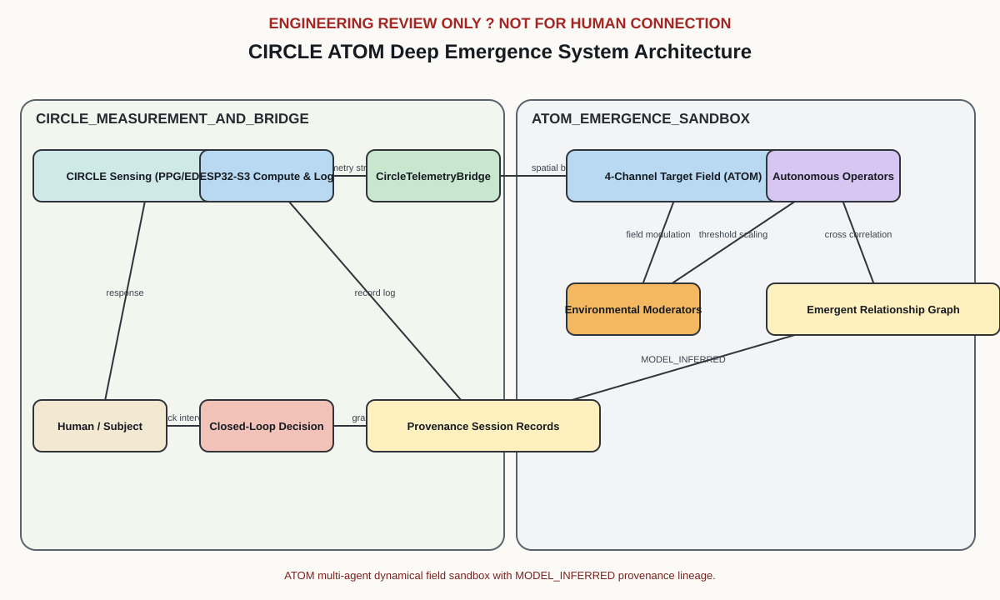
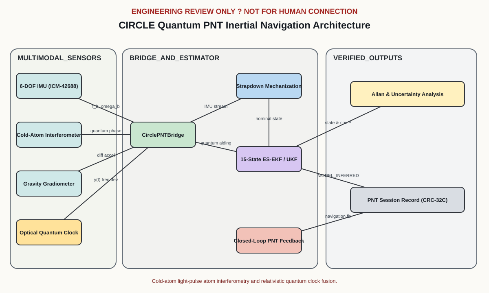

# CIRCLE

**Most sensors stop at measurement. Circle begins there.**

CIRCLE is an open-source biosignal research platform for exploring how physiological signals move together over time—and how closed-loop systems can sense, record, and respond to those changing patterns.

It combines synchronized physiological sensing, deterministic recording, isolated laboratory synchronization, and locally evidenced feedback within a single reviewable architecture.

> **ENGINEERING REVIEW ONLY** — Experimental research hardware. This repository is not approved for fabrication or human connection and does not establish medical-device, electrical-safety, EMC, or measurement-performance claims.

---

## What CIRCLE explores

Human physiology is inherently multimodal.

Attention, stress, emotion, arousal, movement, and awareness do not emerge from a single measurement. They arise from the changing relationships among many signals and conditions.

CIRCLE is designed to capture multiple dimensions of physiological activity within a shared timing and provenance model, providing an experimental foundation for studying relationships among physiological state, movement, context, and feedback.

The system combines:

- **EDA** (Electrodermal Activity) via ADS1220 24-bit ADC & OPA2192 instrumentation
- **PPG** (Photoplethysmography) preserving raw optical red (660 nm) and infrared (880 nm) channels via MAX30102
- **IMU** 6-axis motion capture via ICM-42688-P
- **Deterministic timestamps** with monotonic microsecond resolution
- **Local microSD storage** buffered by 8 MB PSRAM for zero-loss logging
- **Haptic feedback** driven by DRV2605L LRA/ERM haptic motor driver
- **Isolated laboratory synchronization** across 5.0 kVrms ISOW7742 boundary
- **Explicit data provenance** preserving measurement vs. model inference vs. intervention

The goal is not simply to collect signals. It is to create an instrument capable of studying **how signals change together** while preserving enough evidence to ask what happened before, during, and after a feedback event.

---

## At a glance

| Parameter | Specifications & Status |
| --- | --- |
| **Purpose** | Open-source experimental biosignal architecture, safety contracts, and schematic review package |
| **Revision** | Rev B |
| **Hardware** | `circle-main` (85×55 mm, 4-layer) compute/acquisition board + replaceable `circle-ppg` (25×18 mm, 4-layer) optical sensor head |
| **Electrical Model** | Human-connected `BAT_HUMAN` domain separated from `LAB_ISO` through reinforced isolation (8.0 mm physical PCB slot, ISOW7742 5.0 kVrms isolator) |
| **Compute** | ESP32-S3-WROOM-1-N16R8 (Dual-core LX7 @ 240 MHz, 16 MB Flash, 8 MB Octal PSRAM) |
| **Storage** | 4-bit SDIO microSD interface with 8 MB PSRAM-buffered asynchronous recording engine |
| **Toolchain** | Python 3.11+ and KiCad CLI 10.0.5 |
| **Status** | Automated repository verification passes; physical fabrication and human connection remain blocked by unresolved review gates |

**Review Artifacts:**
[3D Animation](diagrams/circle-3d-animation.gif) ·
[Interactive 3D WebGL Viewer](diagrams/circle-3d-viewer.html) ·
[System Architecture](diagrams/system-architecture.svg) ·
[Safety Analysis](docs/safety-analysis.md) ·
[Resonance Architecture](diagrams/resonance-architecture.svg) ·
[Resonance Safety](diagrams/resonance-safety-boundary.svg) ·
[Resonance Geometry](diagrams/resonance-geometry.svg) ·
[Emergence Architecture](diagrams/emergence-architecture.svg) ·
[Quantum PNT Architecture](diagrams/quantum-pnt-architecture.svg) ·
[Main Schematic](hardware/reports/pdf/circle-main.pdf) ·
[Optical Schematic](hardware/reports/pdf/circle-ppg.pdf) ·
[Review Gates](docs/review-gates.md) ·
[Verification Summary](hardware/reports/verification-summary.json)

---

## Hardware Architecture & Resonance Assembly


3D turntable visualization of the CIRCLE Rev B architecture: `circle-main` (85×55 mm compute & biosignal acquisition board) with 8.0 mm reinforced isolation slot, `circle-ppg` (25×18 mm optical contact head), and the external **3-Sphere $\phi$-Resonance Chamber** with central **Merkaba (Dual-Tetrahedral) Core**.

### Interactive 3D WebGL Viewer & Vers3Dynamics Spatial Intelligence

The standalone interactive browser viewer [`diagrams/circle-3d-viewer.html`](diagrams/circle-3d-viewer.html) provides real-time 3D spatial intelligence for the CIRCLE assembly directly in web browsers (no web server required):

* **Vers3Dynamics Tactical Telemetry HUD:** Live telemetry monitoring of spatial coordinates, rotation rate, core stability, phase lock, drive power, and dielectric boundary integrity.
* **Sensor Optics Modes:** Dynamic optical filter simulation including Normal, CRT scanline, NVG (Night Vision Green), FLIR thermal spectrum, and Thermal NOIR modes.
* **Interactive 3D Assembly & Exploded View:** Smooth 360° orbit/pan/zoom controls, component highlighting, and animated exploded view toggles.
* **Resonance & Emergence Overlay:** Real-time spatial field overlay visualization of Merkaba field dynamics, phase lock, and multi-channel field excitations.

---

## Research Modules

CIRCLE extends beyond baseline biosignal acquisition through three research modules:

### 1. Resonance Research Module

The **CIRCLE Resonance Module** provides a modular, evidence-before-inference experimental extension to investigate whether externally driven resonant fields, geometric proportions ($\phi \approx 1.6180339887$), and multi-frequency phase relationships produce reproducible changes in synchronized physiological and environmental sensor signals.

Instead of presupposing outcomes, CIRCLE formalizes the empirical question as a balanced hypothesis test:

$$H_0: R_\phi = R_\text{control} \quad \text{versus} \quad H_1: R_\phi \neq R_\text{control}$$

while systematically testing:
* **Geometry:** $\phi$-spaced ($D, D/\phi, D/\phi^2$) vs equal-spaced vs random spacing vs unpowered sham
* **Core:** Dual-interpenetrating tetrahedron (Merkaba) vs spherical core vs cubic core vs empty cavity
* **Drive:** Active multi-frequency drive vs matched $50\ \Omega$ sham dummy load
* **Discrimination:** Verified biological response vs electronic phantom instrumentation pickup (EMI/thermal drift)

#### Key Architectural Invariants:
* **Neutral Physical Laws:** All geometries are evaluated using identical physical equations and calibration assumptions; geometric differences arise strictly from physical cavity dimensions and clearances. Non-linear harmonics and mode splitting emerge dynamically from coupled differential equations.
* **Unbiased Search & Adaptive Learning:** Default parameter search samples log-uniformly across the spectrum; closed-loop exploration updates Gaussian Process posteriors with Upper Confidence Bounds (GP-UCB).
* **Decoupled Opaque Blinding:** Trials use cryptographically random opaque tokens (`TRIAL-XXXXXXXX`) and sealed trial manifests.
* **Strict Electrical Isolation:** Zero conductive connection to `BAT_HUMAN`; synchronization interfaces exclusively across the 5.0 kVrms ISOW7742 `LAB_ISO` barrier.
* **Conservation of Energy:** Enforces $P_\text{out} \le P_\text{in}$ with thermal dissipation accounting.


---

### 2. Emergence Research Module (IONS-X Deep Emergence)

The **CIRCLE Emergence Module** integrates the **ATOM (Analyses, Targets, Operators, Moderators)** correlation exploration engine from the IONS-X Deep Emergence Lab into the CIRCLE platform.

It provides a repeatable, deterministic sandbox for exploring how coupled physiological signals (EDA, raw optical PPG, 6-axis IMU) and resonance cavity drive excitations form emergent cross-channel correlations across spatial fields under environmental moderation (geomagnetic $K_p$, lunar phase, sidereal time, and solar X-ray flux).

#### Key Features:
* **ATOM Architecture:** Coupled 4-channel spatial-temporal dynamical field (EM/RF, Optical/IR, Consciousness/Resonance proxy, Null Control).
* **Autonomous Spatial Operators:** Ensemble of roving perceivers, forecasters, and integrators calculating sliding-window Pearson correlations.
* **Deterministic Provenance:** All discoveries emit schema-compliant `MODEL_INFERRED` session records with monotonic microsecond timestamps and Castagnoli CRC-32C integrity checksums.
* **Empirical & Longitudinal Telemetry:** Ingests live or recorded CIRCLE session streams and outputs interactive HTML animations, `.metrics.json` sidecars, and compressed longitudinal study logs.



---

### 3. PNT Estimator Research Module (QPNS-X)

The runnable **PNT benchmark** compares the implemented 15-state estimator with an unaided inertial baseline using identical simulated IMU samples and known ground truth. A lower-rate reference accelerometer supplies bias observations; seeded sensor noise makes runs reproducible.

* **Calculated errors:** Position and velocity RMSE come from the evaluated trajectory, with a baseline comparison and an exported trace.
* **Bounded reference updates:** Synchronized IMU-minus-reference observations, Mahalanobis outlier rejection, linear solves, and Joseph-form covariance updates.
* **Auditable exports:** Metrics retain the configuration and seed; a validated session record references the metrics file by SHA-256 and labels its inputs as simulated.
* **Explicit scope:** Translation with known initial pose. Quantum-state propagation, atom fringes, UKF, gradiometer fusion, and clock fusion remain research extensions; this benchmark does not validate those capabilities or hardware accuracy.

The diagram below describes the broader research architecture. See the [implemented experiment and its limits](docs/reproducible-experiments.md#pnt-benchmark-with-ground-truth).



---

## System Architecture

### `circle-main` (Main Compute & Acquisition Board)

The primary compute and acquisition board (85×55 mm, 4-layer, ENIG finish) combines:

- **Compute Core:** ESP32-S3-WROOM-1-N16R8 (16 MB Flash, 8 MB Octal PSRAM)
- **Power System:** BQ24074 LiPo charger & power-path controller + TPS63070 high-efficiency buck-boost converter
- **Precision EDA Subsystem:** ADS1220 24-bit delta-sigma ADC + OPA2192 ultra-low noise instrumentation amplifier + REF5020 high-precision voltage reference
- **Motion Capture:** ICM-42688-P 6-axis low-noise IMU (accelerometer & gyroscope)
- **High-Speed Storage:** 4-bit SDIO microSD interface with PSRAM circular buffer
- **Reinforced Isolation:** ISOW7742 digital isolator with integrated isolated DC/DC power supply (5.0 kVrms rating)
- **Tactile Feedback:** DRV2605L haptic driver supporting ERM & LRA actuators
- **Observability & Diagnostics:** MCP23017 I/O expander with 16 dedicated hardware testpoints

### `circle-ppg` (Replaceable Optical Sensor Board)

A keyed, replaceable optical contact head (25×18 mm, 4-layer) preserving raw optical measurements:

- **Pulse Oximeter & Biosensor:** MAX30102 with raw Red (660 nm) and Infrared (880 nm) optical LEDs
- **Power & Level Translation:** LP5907 ultra-low-noise 1.8V LDO + TXS0102 bidirectional I²C level translator
- **Hardware Identification:** AT24CS02 EEPROM containing pre-programmed factory unique 128-bit UID
- **Auxiliary Motion:** LIS2DW12 low-power accelerometer (DNI in Rev B base build)

### Data Pipeline Architecture

```text
Sensors (EDA, PPG, IMU)
   ↓
Microsecond Monotonic Timestamping
   ↓
SRAM / PSRAM Circular Buffering
   ↓
Session Record Assembly + Provenance Tagging
   ↓
Asynchronous SDIO microSD Storage
   ↓
Derived Telemetry & Closed-Loop Feedback
```


---

## Closed-Loop Execution Model

CIRCLE is built around a closed-loop research paradigm:

```text
Human Participant
  ↓
Physiological Dynamics (EDA, PPG, IMU)
  ↓
CIRCLE High-Speed Acquisition
  ↓
Timestamped & Provenance-Aware Records
  ↓
Model Inference / Adaptive Decision
  ↓
Local Response (Haptic / Resonant Intervention)
  ↓
Human Response
  ↓
Continuous Measurement & Verification
```

By embedding feedback directly within the timestamped recording pipeline, CIRCLE ensures that intervention events are measured with the exact same provenance and temporal precision as physiological signals.

---

## Safety Boundary & Domain Isolation

The CIRCLE hardware architecture strictly isolates the human-connected domain (`BAT_HUMAN`) from laboratory instruments and power sources (`LAB_ISO`).

- **Physical Isolation:** An 8.0 mm unplated copper-cutout slot runs through all 4 layers of the PCB.
- **Electrical Isolation:** Texas Instruments ISOW7742 reinforced digital isolator provides 5.0 kVrms isolation and 100 mW isolated DC/DC power transfer.
- **Attachment Policy:** Connecting USB or debug interfaces automatically disables the human-connected EDA path via hardware interlocks.


Review [docs/architecture.md](docs/architecture.md) and [docs/safety-analysis.md](docs/safety-analysis.md) before evaluating schematics or PCBs.

> **WARNING:** Passing automated repository validation does **NOT** authorize physical fabrication, powered electrode operation, or connection to human subjects.

---

## What "Verified" Means

The checked-in [`hardware/reports/verification-summary.json`](hardware/reports/verification-summary.json) records the automated execution state of repository verification tools.

In CIRCLE, **verified** signifies that the design artifacts, schemas, design rules, schematic syntax, and software models are internally consistent and reproducible using the pinned toolchain.

It does **not** constitute medical, regulatory, safety, or physical hardware authorization.

| Verification Scope | Evidence / Mechanism | Status |
| --- | --- | --- |
| **Repository Contracts** | Unit test suite + design manifest & JSON schema validators | ✅ Checks Pass |
| **Generated Artifacts** | Rendered SVG diagrams, HTML 3D viewers, schematics regenerate deterministically | ✅ Checks Pass |
| **Schematic Syntax & ERC** | KiCad CLI schematic parsing and Electrical Rules Checking (0 violations across 10 sheets) | ✅ Checks Pass |
| **PCB DRC & Routing** | KiCad DRC rules (0 rule violations; unrouted copper nets gated under SHA-256 fingerprinted allowlist) | ⚠️ Open Allowlist |
| **Safety / Isolation / SI** | Review gates documented in `docs/review-gates.md` | ⚠️ Open Gates |
| **Physical Fabrication** | Bench fabrication, assembly, and optical alignment | ❌ Not Validated |
| **Human Electrode Use** | Biological subject testing and active contact | ❌ Not Validated |
| **EMC / Regulatory** | FCC / CE / IEC 60601-1 compliance testing | ❌ Not Validated |

---

## Quick Start & Installation

### Prerequisites

Install required Python dependencies:

```bash
git clone https://github.com/topherchris420/circle.git
cd circle

pip install -r requirements.txt
```

### Running Fast Repository Checks

After installing `requirements.txt`, run the software and contract checks:

```bash
# Run unit tests
python -m unittest discover -s tests

# Check design manifest integrity
python tools/check_design_manifest.py

# Validate session record schemas
python tools/check_record_schema.py

# Validate research module contracts
python tools/check_emergence_contract.py
python tools/check_pnt_contract.py
python tools/check_resonance_contract.py
```

---

## Reproducible runs and evidence audit

```bash
# Evaluate every frame without rendering an animation
python tools/run_emergence_lab.py --quick --headless --seed 42 \
  --output outputs/emergence.html --export-session-records outputs/emergence-record.json

# Audit actual exported records (single JSON, arrays, or NDJSON)
python tools/check_session.py outputs/emergence-record.json

# Verify software explicitly when KiCad is unavailable
python tools/verify_release.py --software-only
```

The [reproducibility guide](docs/reproducible-experiments.md) covers validated session replay, a [synthetic telemetry example](experiments/emergence/telemetry.example.ndjson), source-column selection, inclusive sequence ranges, simulation provenance, and verification scopes. Animation redraws do not change the experiment. Supplied control data and native device times are preserved.

---

## Executing Research Experiments

CIRCLE includes complete, runnable research experiment tools for field simulation and session log analysis:

### 1. Emergence Lab Simulation (IONS-X ATOM)

To run the Deep Emergence simulation and generate an interactive HTML visualizer with sidecar metrics:

```bash
# Run quick benchmark simulation
python tools/run_emergence_lab.py --quick --output docs/emergence-demo.html

# Run balanced multi-agent experiment with exported session records
python tools/run_emergence_lab.py --experiment balanced --frames 120 --export-session-records docs/emergence-session.json
```

Open the resulting `.html` output file in any web browser to view the spatial field dynamics, autonomous operator trajectories, and sliding-window Pearson cross-correlations.

### 2. Quantum PNT Experiment Simulator (QPNS-X)

To execute the cold-atom matter-wave interferometer and ES-EKF navigation simulation:

```bash
# Compare the estimator with an unaided baseline against simulated truth
python tools/run_pnt_experiment.py --duration 10.0 --dt 0.01 --seed 42 --output-session-record outputs/pnt-session.json
```

---

## Complete Release Verification

The complete verification script [`tools/verify_release.py`](tools/verify_release.py) validates the entire repository by re-running ERC, DRC, schema checks, model simulations, and artifact generation.

### Execution Command

Ensure `kicad-cli` (v10.0.5) is installed or specify its location via `KICAD_CLI`:

```bash
# POSIX / Linux / macOS
KICAD_CLI=/usr/bin/kicad-cli python tools/verify_release.py

# Windows (PowerShell)
$env:KICAD_CLI="C:\Program Files\KiCad\10.0\bin\kicad-cli.exe"
py -3.11 tools/verify_release.py
```

A complete successful run concludes with:

```text
CIRCLE Rev B review package: VERIFIED
```

Missing KiCad produces `INCOMPLETE` and a nonzero exit code. Explicit `--software-only` mode reports `SOFTWARE_VERIFIED` and never sets the full-release `verified` flag. Fresh hardware checks require the exact version in `toolchain.json`; CI pins the same Docker image by digest.

---

## PCB Layout & Schematic Regeneration

Both board layouts are generated deterministically from source code via [`tools/build_clean_pcb.py`](tools/build_clean_pcb.py):

```bash
# Regenerate board files deterministically
python tools/build_clean_pcb.py

# Re-render architecture schematics
python tools/generate_schematics.py --board circle-main
python tools/generate_schematics.py --board circle-ppg
```

To re-export fabrication artifacts (Gerber files, drill files, position files, STEP 3D models):

```bash
kicad-cli pcb export gerbers -o hardware/reports/gerbers/circle-main/ hardware/circle-main/circle-main.kicad_pcb
kicad-cli pcb export drill   -o hardware/reports/gerbers/circle-main/ hardware/circle-main/circle-main.kicad_pcb
kicad-cli pcb export pos     -o hardware/reports/pos/circle-main-pos.csv hardware/circle-main/circle-main.kicad_pcb
kicad-cli pcb export step    -o hardware/reports/step/circle-main.step hardware/circle-main/circle-main.kicad_pcb
```

---

## Data Contract & Provenance Hierarchy

All data emitted or captured by CIRCLE adheres to [`contracts/session-record.schema.json`](contracts/session-record.schema.json).

### Data Provenance Types

To ensure scientific integrity and eliminate ambiguity between direct observations and model outputs, every record specifies a strict provenance mode:

| Provenance Mode | Description & Application |
| --- | --- |
| `RAW_MEASURED` | Raw, direct physical observations from hardware sensors (e.g. ADS1220 ADC codes, MAX30102 PPG optical counts, ICM-42688-P IMU readings). |
| `DERIVED` | Direct mathematical transformations of raw physical data without stochastic models (e.g. bandpass filtering, unit conversion, FFT spectra). |
| `MODEL_INFERRED` | States estimated by algorithmic models, estimators, or neural networks (e.g. ES-EKF pose, ATOM correlation matrices, GP-UCB predictions). |
| `SIMULATED` | Pure synthetic data produced by physics engines or numeric simulators. |
| `TEST` | Synthetic validation vectors injected during bench checkouts and automated testing. |
| `INTERVENTION` | Recorded feedback events triggered by the closed-loop system (e.g. haptic pulses, resonance frequency adjustments). |

Records carry microsecond time bounds and provenance, with source lineage where required. CRC-32C detects accidental corruption; it is not authentication. The session auditor validates schema contents, checksums, sequence continuity, and semantic time/range constraints.

---

## Suggested Review Path

When reviewing the CIRCLE architecture:

1. **Architecture Overview:** Read [`docs/architecture.md`](docs/architecture.md) and inspect [`diagrams/system-architecture.svg`](diagrams/system-architecture.svg).
2. **Safety & Domain Isolation:** Review [`docs/safety-analysis.md`](docs/safety-analysis.md) alongside [`diagrams/safety-boundaries.svg`](diagrams/safety-boundaries.svg).
3. **Schematics Review:** Examine rendered schematics for [`circle-main`](hardware/reports/pdf/circle-main.pdf) and [`circle-ppg`](hardware/reports/pdf/circle-ppg.pdf).
4. **Interactive 3D Hardware:** Launch [`diagrams/circle-3d-viewer.html`](diagrams/circle-3d-viewer.html) in a browser to inspect physical layouts and component clearance.
5. **Review Gates:** Audit unresolved items in [`docs/review-gates.md`](docs/review-gates.md).
6. **Electrical Specifications:** Inspect [`docs/pin-allocation.md`](docs/pin-allocation.md), [`docs/power-budget-analysis.md`](docs/power-budget-analysis.md), and [`docs/timing-and-data-model.md`](docs/timing-and-data-model.md).
7. **Research Subsystems:** Study the [Resonance](docs/resonance-architecture.md), [Emergence](docs/emergence-architecture.md), and [Quantum PNT](docs/quantum-pnt-architecture.md) module specs.
8. **Verification:** Execute `python tools/verify_release.py` and inspect [`hardware/reports/verification-summary.json`](hardware/reports/verification-summary.json).

---

## Repository Map

```text
circle/
├── contracts/               # Machine-readable JSON schemas (session records, emergence, quantum PNT)
├── diagrams/                # System, safety, resonance, emergence, & quantum PNT diagrams + WebGL 3D viewer
├── docs/                    # Architectural, safety, power budget, pinout, & gate review documentation
├── experiments/             # Protocol definitions and control specifications for research modules
├── hardware/
│   ├── circle-main/         # KiCad project files for 85x55 mm main compute/acquisition board
│   ├── circle-ppg/          # KiCad project files for 25x18 mm optical sensor head
│   ├── libraries/           # Custom symbol libraries (23 ICs, 269 pins) and footprints
│   ├── reports/             # Generated PDFs, Gerbers, BOMs, STEP models, and DRC/ERC logs
│   ├── design-manifest.json # Complete pin, network, part, and GPIO allocation specification
│   └── interfaces.json      # Electrical domain and inter-board interface contracts
├── models/                  # Physics simulators & telemetry bridges (emergence, quantum PNT, resonance)
├── tests/                   # Automated repository contract, schema, and simulation test suite
└── tools/                   # PCB builders, schematic generators, verifiers, and experiment runners
```

---

## Known Limitations & Safety Disclaimers

- Safety, power isolation, signal integrity, and footprint review gates remain fabrication blockers.
- Values marked `REVIEW_GATE` in documentation require independent engineering calculation and physical bench testing.
- KiCad 10.0.5 parses, ERC-checks, and exports legacy schematic files, but native `.kicad_sch` conversion is pending.
- ERC validates schematic syntax; architecture-level annotations do not replace full PCB trace fabrication checks.
- Zero physical fabrication, powered electrode operation, human subject research, EMC testing, or medical validation has been performed.
- Physiological biosignals must never be interpreted as direct or unmediated readings of subjective mental or emotional states.

Pinned toolchain parameters are defined in [`toolchain.json`](toolchain.json).

---

## The Premise

**A human state is rarely one signal.**

CIRCLE explores what becomes possible when those signals are synchronized, preserved, and allowed to speak in relation to one another.

The challenge is not simply measuring the body.

It is learning how its signals move together—and building instruments precise enough to listen.

---

### Vers3Dynamics

CIRCLE is an open-source research project by **Vers3Dynamics**, exploring the space where mind, body, and machine begin to resonate.

**Built by one researcher.  
Held in common.  
Free to explore.**
