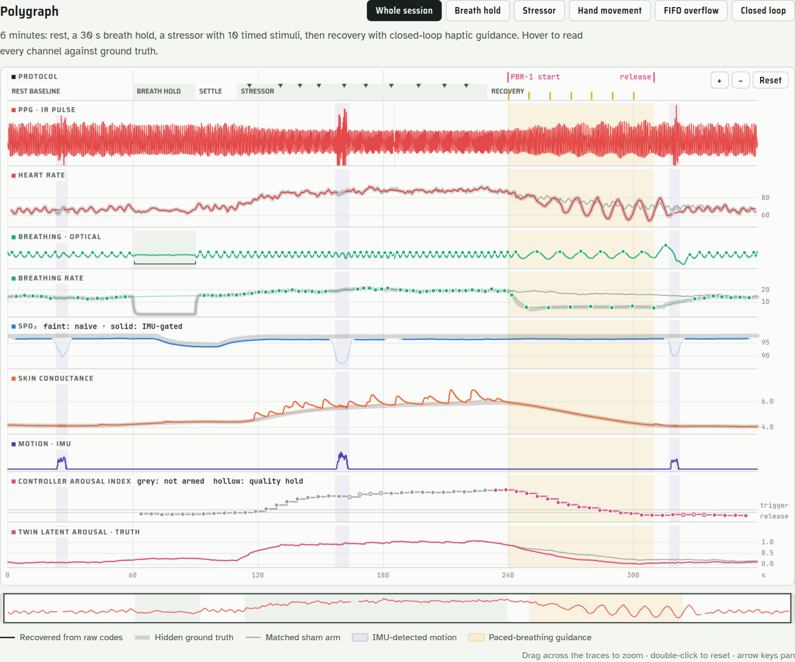
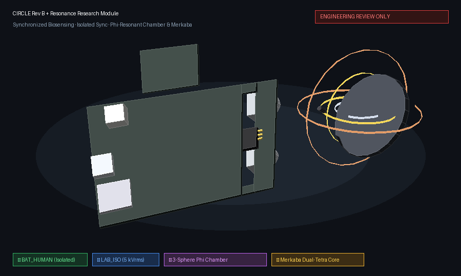

# CIRCLE

**An open-source closed-loop biosignal research instrument that preserves the evidence between measurement, decision, intervention, and observed response.**

> **ENGINEERING REVIEW ONLY** — Experimental research hardware. This repository is not approved for fabrication or human connection and does not establish medical-device, electrical-safety, EMC, or measurement-performance claims.

Most sensing systems stop at measurement. CIRCLE asks what happens next: can a system detect a changing relationship among physiological signals, make a bounded decision using only what it knew at that moment, issue an intervention, independently observe whether the intervention physically happened, and let another researcher replay the whole thing from the raw data?

```
sense → preserve → infer → decide → intervene → observe → verify
```

The evidence chain is the product. Point at any closed-loop event and ask **why did CIRCLE do that?** The record leads back to the exact samples that caused the decision, and forward to the independent observation of what actually occurred.

---

## What exists, and what does not

| | Status |
|---|---|
| Signal pipeline, closed-loop controller, evidence export, audit and replay | **Implemented**, validated only against a simulated physiology twin |
| Adversarial scenario suite and experiment-protocol boundary | **Implemented**, simulation only |
| Acquisition boundary: one closed loop for simulated, recorded, and live sources | **Implemented**, exercised with the twin over a simulated link and with recorded bundles; no live device connected |
| Muse Gadget SDK adapter | **Implemented** within what the SDK supports, which is no physiological sensing; tested against a simulator and the SDK's own code, never a paired gadget |
| Rev B hardware (`circle-main`, `circle-ppg`) | **Designed, not built.** Schematics pass ERC; PCBs are **not routed** (DRC passes only with an open allowlist) |
| Firmware | **Not implemented.** The twin encodes the timing behavior firmware must meet |
| Bench, phantom, electrical-safety, EMC, physiological, or human validation | **None performed** |
| Resonance, emergence, PNT modules | Bounded research extensions with explicit status ([`capabilities.json`](capabilities.json)) |

---

## Run the digital test bench

```bash
pip install -r requirements.txt
python tools/run_physiology_twin.py --output outputs/physiology --audit
```

About ten seconds later you have a six-minute closed-loop session (rest, breath hold, stressor, recovery with haptic guidance), scored against hidden truth and independently audited:

```
SESSION:          TWIN-CLEAN-S7-ACTIVE
MODE:             SIMULATED
HARDWARE:         Rev B forward model (no hardware built)
CONTROLLER:       1.2.0
INPUT:            4 streams (imu, ppg, eda, sync)
GAPS:             1 declared
EVALUATIONS:      59 (2 decisions, 9 failed a quality gate, 0 held an action)
INTERVENTIONS:    1 program(s), 7/7 cues physically observed
HUMAN DATA:       NONE
HARDWARE DRIVEN:  NONE
audit replay status: REPLAY_MATCH
```

Open `outputs/physiology/report.html` (an example is committed at [`diagrams/circle-physiology-session.html`](diagrams/circle-physiology-session.html)). Click any row of the decision ledger to follow it down the evidence stack: formula → components → input cutoff → quality gates → exact sample ranges. The execution table shows, per cue, whether the command was followed by an electrical onset and by vibration the wrist IMU independently observed.



### What it proves

Under known simulated truth, the software's measurement, timing, decision, and evidence logic behave as specified:

| Recovered from raw Rev B codes (held-out seeds 100–149) | Result |
|---|---|
| Heartbeats from PPG (±50 ms, motion-free) | F1 0.9999 |
| Heart rate · HRV (RMSSD) | MAE 0.39 bpm · 1.5 ms |
| Breathing rate · breath hold | MAE 0.36 /min · IoU 0.98 |
| Skin conductance responses | sensitivity 0.98 · PPV 1.00 |
| SpO₂ during hand movement | 0 false desaturations after gating |
| PPG timestamps across a FIFO overflow | worst 39 µs (spec ≤ 1 ms); loss declared exactly |
| Haptic command → IMU-observed vibration | within 3 ms of truth |

999 of 1000 checks pass; the failure (seed 147, SCR sensitivity) is retained and explained in [the pipeline methods](docs/physiology-pipeline.md). The adversarial suite is evaluated on seeds never examined during development; each held-out round so far has exposed a controller defect, fixed on principle and re-evaluated on fresh seeds. The last one (controller 1.1.0, seeds 500–529, 199/210) was the loop starting guidance on the lagging tail of a state that had resolved during 45 s of motion; controller 1.2.0 holds instead until a full evidence window has been observed clean. Confirmatory round on never-examined seeds 600–629, eight scenarios: **240/240 runs pass** ([`scenario-benchmark.json`](docs/scenario-benchmark.json)). See [closed-loop evidence](docs/closed-loop-evidence.md).

### What it does not prove

Hardware safety, electrical performance, physiological accuracy, or any effect on people. The twin is phenomenological; its paced-breathing response is **assumed**. The matched sham arm shows the evidence chain can resolve an effect under that assumption, not that the effect exists. Simulation success is not hardware validation, and repository verification is not permission for fabrication or human connection.

---

## Closed-loop evidence

- **Decision ≠ command ≠ actuation ≠ effect ≠ interpretation.** Each is a different record. Every cue earns an execution stage (`COMMAND_ONLY` → `ELECTRICAL_ONSET_OBSERVED` → `PHYSICALLY_OBSERVED`) only from its own evidence; the contract rejects a stage the evidence does not earn. No record asserts that physiology changed.
- **Every decision obeys time.** Each sample carries when it was taken and when firmware held it in memory. Decisions record `decision_time_us` and `input_cutoff_us`; the audit fails any decision that used evidence from its future, whatever produced it.
- **The auditor rebuilds the whole session.** Every record that is not a device record (clock mapping, physiology windows, baseline, evaluations, IMU-observed onsets, interventions) is a pure function of the raw bundle and the device events, so the auditor re-derives all of them and requires a bit-for-bit match. A forged window, observation, intervention stage, or clock mapping fails even when its CRC, the ledger, and the manifest were rewritten consistently.
- **Replay has an explicit status:** `REPLAY_MATCH`, `REPLAY_DIVERGENCE`, `TIMING_VIOLATION`, `VERSION_MISMATCH`, `EVIDENCE_INTEGRITY_FAILURE`, `MISSING_SOURCE`, or `INSUFFICIENT_EVIDENCE`. Divergence is surfaced, never reconciled.
- **Quality gates have teeth.** Stale data, saturation, electrode contact loss, optical coupling change, low beat coverage, motion (including at the cutoff), and single-system signals all produce recorded holds. A loop that cannot observe its effect stops.
- **Sustained means observed.** After any impairment, the controller must see a full 40 s evidence window clean before it may call a state sustained and start guidance (`HOLD_EVIDENCE_GAP`). The first adequate evaluations after a blind spell cannot tell a sustained state from the lagging tail of one that resolved unseen.
- **The twin tries to break the loop both ways:** motion, poor contact, timing faults, sensor loss, feedback artifact, and ambiguous physiology try to make it act when it should not; a warranted state briefly obscured by motion tries to make it fail to act when it should. All are judged against hidden truth rather than the controller's own gates.
- **Provenance classes** stay distinct: `RAW_MEASURED`, `DERIVED`, `MODEL_INFERRED`, `SIMULATED`, `TEST`, `INTERVENTION` ([`contracts/session-record.schema.json`](contracts/session-record.schema.json)). CRC-32C and SHA-256 detect accidental change; they are not authentication.

```bash
python tools/audit_physiology_run.py outputs/physiology          # re-derive, replay, check time and execution
python tools/run_physiology_twin.py --sham --output outputs/sham # matched arm: decisions logged, cues not actuated
python tools/run_physiology_twin.py --scenarios                  # adversarial suite
python tools/run_physiology_twin.py --benchmark 50               # held-out physiology benchmark
```

### AI may propose; CIRCLE executes the contract

Better models should gain analytical resolution, not authority. A proposed experiment (from a person or a model) is compiled into a structured protocol, validated deterministically (simulation target only, mandatory sham arm, gates may only tighten, causality margin untouchable, held-out seeds, Holm correction), then authorized by a named human bound to the protocol's SHA-256, then executed against the twin.

```bash
python tools/run_protocol.py validate experiments/protocols/paced-breathing-arousal.json
python tools/run_protocol.py authorize experiments/protocols/paced-breathing-arousal.json --reviewer "Your Name" --output outputs/auth.json
python tools/run_protocol.py run experiments/protocols/paced-breathing-arousal.json --authorization outputs/auth.json --output outputs/protocol-result.json
```

---

## Hardware sources: one loop for simulation, recordings, and live devices

CIRCLE owns the experiment; hardware provides observations and executes bounded interventions. Every source of device records reaches the controller through one boundary ([`models/physiology/loop.py`](models/physiology/loop.py)). It refuses a source that cannot supply what the pipeline reads, listing every reason, and refuses any actuator aimed at hardware, a person, or an operator channel before anything is acquired.

```
                          CIRCLE
                             │
           ┌─────────────────┼──────────────────┐
           │                 │                  │
      Simulation         Recording         Live hardware
      twin through       hash-verified     ingestion boundary:
      the Rev B          raw bundle        declared losses, link
      forward model           │            state, host receipt
           │                  │                 │   Muse Gadget SDK:
           │                  │                 │   no physiological
           └─────────────────┼──────────────────┘   stream, so refused
                             ↓                      by the contract
                 Input contract · RawSession
                             ↓
                    Physiology pipeline
                             ↓
               State estimate (arousal index)
                             ↓
           Controller (quality gates, agreement)
                             ↓
            Actuation gate (SIMULATED or NONE)
                             ↓
           Intervention → independently observed
                             ↓
                   Response measurement
                             ↓
              Provenance · audit · replay
```

Rendered: [`diagrams/acquisition-boundary.svg`](diagrams/acquisition-boundary.svg). The twin now runs through this same loop, and its exported evidence is byte-identical to before. Delivered chunk by chunk over a link that corrupts, repeats, stalls, and drops, the twin's session still audits as `REPLAY_MATCH`: losses become exact `GAP`s, silence becomes recorded link states and stale-data holds (never a calm subject), and availability is stamped at host receipt so the recording replays exactly what the controller could see.

**The Muse Gadget SDK, as it is.** [Meta's Muse Gadget SDK](https://github.com/facebookincubator/muse-gadget-sdk) connects ESP32 boards and Linux computers to Muse, Meta's AI assistant; control flows from the assistant to the device. It carries no physiological signal, no sample clock, and no timestamps, so it cannot be a biosignal source and CIRCLE does not treat it as one. What it adds:

- **Capability discovery** that reports what a gadget environment actually offers: `signals: []`, always.
- **A recorded refusal.** Offered to the closed loop, the gadget is refused by the input contract, and the refusal is written as an ordinary session.
- **An operator channel outside the loop.** A templated end-of-session status, built only from whitelisted passport fields, posted to a Muse side chat. Never a cue: the loop refuses it as an actuator.
- **AI proposals without authority.** A command set that lets the assistant read CIRCLE's capabilities and validate a proposed protocol, and nothing else. A named human still authorizes. The stock Linux gadget's shell access must never reach a CIRCLE host.

What Muse does not replace: CIRCLE's simulation, physiology models, experiment contracts, provenance, replay, safety architecture, or controller. The adapter is removable, and no core module imports it (`tools/check_module_registry.py`). Setup, privacy, mapping, and limitations: [hardware sources](docs/hardware-sources.md).

```bash
python tools/run_acquisition_demo.py                  # damaged link → audit → recorded replay → Muse refusal → notification
python tools/muse_gadget.py capabilities --simulate    # discovery against a simulated gadget service
python tools/muse_gadget.py check --simulate           # the loop refuses the gadget; the refusal is a session
```

Building this boundary surfaced two latent evidence defects, both fixed and now tested: a session with two separate losses on one stream failed its own audit (the `sensor_loss` scenario's export did), and the clock-mapping record's lineage would have spanned lost sync pulses.

---

## Hardware architecture (Rev B, designed, not built)

- **`circle-main`** (85 × 55 mm, 4-layer): ESP32-S3-WROOM-1-N16R8; ADS1220 EDA front end with REF5020 and OPA2192; ICM-42688-P IMU; 4-bit SDMMC with PSRAM buffering; DRV2605L haptics with a TLV3201 current-edge detector so actuation leaves electrical evidence; BQ24074 + TPS63070 power; MCP23017 observability.
- **`circle-ppg`** (25 × 18 mm): MAX30102 raw red/IR, LP5907, TXS0102, AT24CS02 ID.
- **Domains:** human-connected `BAT_HUMAN` separated from `LAB_ISO` by an ISOW7742 isolator (component rating 5.0 kVrms reinforced; the assembled barrier is untested) and an 8.0 mm board slot. Hardware interlocks are designed to remove electrode drive when USB, debug, or expansion cables are attached; the calculated single-fault electrode current is ≤ 27.5 µA (unreviewed calculation).

Numbers above are datasheet ratings, calculations, or design targets unless stated otherwise ([where numbers come from](docs/verification-scopes.md#where-numbers-come-from)). Before any body contact, evidence must climb the [physical evidence ladder](docs/physical-evidence-ladder.md): electronic and optical phantoms, bench sensors, isolated system tests, hardware loopback, and only then, after independent safety review and ethics approval, any human-connected session.

Review artifacts: [architecture](docs/architecture.md) · [system diagram](diagrams/system-architecture.svg) · [safety analysis](docs/safety-analysis.md) · [safety boundaries](diagrams/safety-boundaries.svg) · [main schematic](hardware/reports/pdf/circle-main.pdf) · [optical schematic](hardware/reports/pdf/circle-ppg.pdf) · [bring-up plan](docs/board-bringup-and-validation-plan.md) · [3D viewer](diagrams/circle-3d-viewer.html) · [hardware animation](diagrams/circle-hardware-animation.html)



The 3D viewer and animations show **intended geometry**. They display no telemetry; nothing in them is simulated or measured.

---

## Research extensions

Each module attaches through contracts, preserves provenance and simulation status, and can be removed without breaking the instrument (`tools/check_module_registry.py` enforces that no core module imports one).

| Module | Implemented | Status | Not claimed |
|---|---|---|---|
| **Resonance** ([docs](docs/resonance-architecture.md), [hypotheses](docs/resonance-hypotheses.md)) | Coupled-cavity simulator; blinded factorial scheduling; autocorrelation-aware permutation tests; phantom discrimination; multiplicity-adjusted statuses | `EXPERIMENTAL` (simulation) | No chamber exists (`SPECULATIVE`); no geometry effect measured. Visualization is not evidence. |
| **Emergence** ([docs](docs/emergence-architecture.md)) | ATOM correlation search, now reported against a circular-shift surrogate null with family-wise correction and a known-truth score | `EXPERIMENTAL` | Discoveries are exploratory correlations; no causal, nonlocal, or consciousness claim |
| **PNT** ([docs](docs/quantum-pnt-architecture.md)) | Translation-only 15-state estimator vs unaided baseline on shared simulated IMU samples with known truth | `SIMULATION_VALIDATED` | Quantum sensing, atom interferometry, gradiometry, clock fusion: `SPECULATIVE`, not implemented |
| **R.A.I.N. protocol** ([docs](docs/rain-circle-experiment-protocol.md)) | Manifest/result/analysis contracts | `CONTRACT_ONLY` | The executor lives in another repository |

The stranger the hypothesis, the more ordinary the measurement discipline: identical measurement logic across conditions, predefined comparisons, blinding, preserved null results, and correction for every configuration searched.

---

## Verification names its scope

```bash
python tools/verify_release.py --software-only   # software scopes; never implies hardware
python tools/verify_release.py                   # also fresh ERC/DRC with the pinned KiCad (toolchain.json)
python tools/check_review_gates.py               # what the open gates do not authorize
```

| Scope | State |
|---|---|
| Software contracts · simulation benchmark · generated artifacts | Pass |
| Schematic ERC | Archived KiCad 10.0.5 reports pass; fresh run requires the pinned toolchain |
| PCB DRC | Zero rule violations **with an open allowlist of 52 unrouted nets** |
| Bench validation · electrical-safety review · isolation withstand · EMC · measurement chain | Not performed |
| Fabrication · human use | **Not authorized** (18 open gates in [`hardware/review-gates.json`](hardware/review-gates.json)) |

Missing KiCad reports `INCOMPLETE`, never success. See [verification scopes](docs/verification-scopes.md).

---

## Repository map

```text
circle/
├── capabilities.json        # every module's status and what it does not claim
├── contracts/               # session records, experiment protocols, review gates, research-module schemas
├── models/
│   ├── physiology/          # twin, Rev B sensor models, pipeline, controller, closed-loop boundary, evidence, audit, ledger
│   ├── acquisition/         # live ingestion, link-fault simulator, recorded replay, refused-source sessions
│   ├── muse_gadget/         # Muse Gadget SDK adapter (removable; the SDK has no physiological signal)
│   ├── protocols.py         # proposal → validation → authorization → simulated execution
│   ├── session_records.py   # contract validation, lineage, CRC-32C
│   └── resonance_response/, emergence/, pnt/   # research extensions
├── tools/                   # runners, auditors, verifiers, PCB and schematic generators
├── tests/                   # contracts, adversarial evidence tests, frozen scenario corpus
├── docs/                    # closed-loop evidence, verification scopes, evidence ladder, hardware and safety docs
├── experiments/             # research protocols and example experiment protocols
├── hardware/                # KiCad sources, design manifest, interfaces, review gates, generated reports
└── diagrams/                # rendered diagrams, session report example, 3D viewer, hardware animation
```

## Limitations

- All physiological data in this repository are simulated. No person has been measured.
- No hardware has been fabricated, powered, or measured; PCBs are unrouted; no firmware exists.
- Automated KiCad checks are not an independent electrical-safety review.
- Physiological signals are observables, not readings of emotion, stress as a diagnosis, intent, or consciousness. The arousal index is an engineering trigger.

---

## The premise

A human state is rarely one signal. The body produces many imperfect signals, and understanding begins in the relationships among them. CIRCLE tries to be humble about what sensors can reveal: it preserves ambiguity, lets different physiological pathways produce similar observations without collapsing them into one score, distinguishes signal from interpretation, and treats an intervention as something that creates new evidence, not as proof that a model was right.

### Vers3Dynamics

CIRCLE is an open-source research project by **Vers3Dynamics**. Built by one researcher. Held in common. Free to explore.
