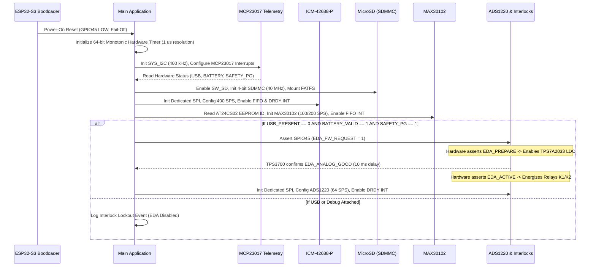

# CIRCLE Rev B Firmware Pin Map & Initialization Guide

> **ENGINEERING REVIEW ONLY — NOT FOR CLINICAL OR HUMAN CONNECTION**

This document specifies the ESP32-S3 GPIO allocation, strapping pin behavior, peripheral bus assignments, interrupt vectors, and hardware bring-up initialization sequence for CIRCLE Rev B.

---

## 1. ESP32-S3 GPIO Allocation & Pin Mapping

| Pin Name | Net Name | Peripheral / Function | I/O Type | Default Pull / Boot State | Strapping Function / Hardware Hazard | Owning Schematic Sheet |
|---|---|---|:---:|:---:|---|---|
| **GPIO0** | `BOOT_BUTTON_ONLY` | Boot Mode Select Button | In/Out | $10\text{ k}\Omega$ PU | **STRAP**: Must be HIGH during reset for normal SPI boot. Grounded only by S1 button press. | `01_compute_usb` |
| **GPIO1** | `SYNC_IN_CAPTURE` | Isolated Laboratory SYNC Input | Input | High-Z | Fast edge capture timer / GPIO interrupt. | `06_sync_isolation` |
| **GPIO2** | `SYNC_OUT_DRIVE` | Isolated Laboratory SYNC Output | Output | Low | Low-jitter pulse generator. | `06_sync_isolation` |
| **GPIO3** | `RESERVED_STRAP` | Unused / Reserved Strap Pin | In/Out | High-Z | **STRAP**: JTAG substrate configuration. Left floating/high-Z. | `01_compute_usb` |
| **GPIO4** | `SD_CLK` | MicroSD SDMMC Clock | Output | $33\text{ }\Omega$ Series | SDMMC Host peripheral (up to 40 MHz). | `05_storage` |
| **GPIO5** | `SD_CMD` | MicroSD SDMMC Command | In/Out | $10\text{ k}\Omega$ PU | SDMMC Host peripheral. | `05_storage` |
| **GPIO6** | `SD_D0` | MicroSD SDMMC Data 0 | In/Out | $10\text{ k}\Omega$ PU | SDMMC Host peripheral (4-bit mode). | `05_storage` |
| **GPIO7** | `SD_D1` | MicroSD SDMMC Data 1 | In/Out | $10\text{ k}\Omega$ PU | SDMMC Host peripheral (4-bit mode). | `05_storage` |
| **GPIO8** | `SYS_I2C_SDA` | System I2C Data Bus | In/Out | $4.7\text{ k}\Omega$ PU | Dedicated bus for MCP23017 expander and DRV2605L haptic driver. | `01_compute_usb` |
| **GPIO9** | `SYS_I2C_SCL` | System I2C Clock Bus | Output | $4.7\text{ k}\Omega$ PU | 400 kHz Fast-Mode I2C. | `01_compute_usb` |
| **GPIO10**| `IMU_SCLK` | ICM-42688-P SPI Clock | Output | Low | Dedicated high-speed SPI bus (up to 24 MHz). | `04_sensors` |
| **GPIO11**| `IMU_MOSI` | ICM-42688-P SPI MOSI | Output | Low | Dedicated high-speed SPI bus. | `04_sensors` |
| **GPIO12**| `IMU_MISO` | ICM-42688-P SPI MISO | Input | High-Z | Dedicated high-speed SPI bus. | `04_sensors` |
| **GPIO13**| `IMU_CS_N` | ICM-42688-P Chip Select | Output | High | Active-Low SPI Chip Select. | `04_sensors` |
| **GPIO14**| `IMU_DRDY` | ICM-42688-P Data Ready INT | Input | High-Z | Hardware timestamp capture interrupt. | `04_sensors` |
| **GPIO15**| `SD_D2` | MicroSD SDMMC Data 2 | In/Out | $10\text{ k}\Omega$ PU | SDMMC Host peripheral (4-bit mode). | `05_storage` |
| **GPIO16**| `SD_D3` | MicroSD SDMMC Data 3 | In/Out | $10\text{ k}\Omega$ PU | SDMMC Host peripheral (4-bit mode). | `05_storage` |
| **GPIO17**| `PPG_SDA_3V3` | Optical Head I2C Data Bus | In/Out | $3.3\text{ k}\Omega$ PU | Dedicated bus for MAX30102 and AT24CS02 EEPROM. | `04_sensors` |
| **GPIO18**| `PPG_SCL_3V3` | Optical Head I2C Clock Bus | Output | $3.3\text{ k}\Omega$ PU | 400 kHz Fast-Mode I2C. | `04_sensors` |
| **GPIO19**| `USB_D_MINUS` | Native USB 2.0 D- | In/Out | $22\text{ }\Omega$ Series | ESP32-S3 internal USB Serial/JTAG or OTG PHY. | `01_compute_usb` |
| **GPIO20**| `USB_D_PLUS` | Native USB 2.0 D+ | In/Out | $22\text{ }\Omega$ Series | ESP32-S3 internal USB Serial/JTAG or OTG PHY. | `01_compute_usb` |
| **GPIO21**| `PPG_INT_N_WIRED_OR`| Optical Head Interrupt | Input | $10\text{ k}\Omega$ PU | Active-Low optical FIFO interrupt. | `04_sensors` |
| **GPIO35**| `UNAVAILABLE_OCTAL_PSRAM`| Embedded PSRAM D4 | Internal | Internal | **OCTAL PSRAM ONLY**: Do not route or configure. | `01_compute_usb` |
| **GPIO36**| `UNAVAILABLE_OCTAL_PSRAM`| Embedded PSRAM D5 | Internal | Internal | **OCTAL PSRAM ONLY**: Do not route or configure. | `01_compute_usb` |
| **GPIO37**| `UNAVAILABLE_OCTAL_PSRAM`| Embedded PSRAM D6 | Internal | Internal | **OCTAL PSRAM ONLY**: Do not route or configure. | `01_compute_usb` |
| **GPIO38**| `ISO_HEALTH_CHALLENGE`| Isolated SYNC Loopback Challenge | Output | Low | Sends periodic test pulse across ISOW7742. | `06_sync_isolation` |
| **GPIO39**| `EDA_SCLK` | ADS1220 ADC SPI Clock | Output | Low | Dedicated precision SPI bus (up to 4 MHz). | `03_eda_safety` |
| **GPIO40**| `EDA_MOSI` | ADS1220 ADC SPI MOSI | Output | Low | Dedicated precision SPI bus. | `03_eda_safety` |
| **GPIO41**| `EDA_MISO` | ADS1220 ADC SPI MISO | Input | High-Z | Dedicated precision SPI bus. | `03_eda_safety` |
| **GPIO42**| `EDA_CS_N` | ADS1220 ADC Chip Select | Output | High | Active-Low SPI Chip Select. | `03_eda_safety` |
| **GPIO43**| `DEBUG_UART_TX` | Debug UART Transmit | Output | High | 115200 / 921600 baud serial console. | `01_compute_usb` |
| **GPIO44**| `DEBUG_UART_RX` | Debug UART Receive | Input | $10\text{ k}\Omega$ PU | Serial console command input. | `01_compute_usb` |
| **GPIO45**| `EDA_FW_REQUEST` | EDA Hardware Enable Request | Output | $4.7\text{ k}\Omega$ PD | **STRAP / SAFETY**: Pulled LOW by hardware resistor. Default fail-off at boot. | `03_eda_safety` |
| **GPIO46**| `HAPTIC_CURRENT_EDGE`| Haptic Electrical Onset INT | Input | $4.7\text{ k}\Omega$ PD | **STRAP / EVIDENCE**: Pulled LOW at boot. Captures TLV3201 edge on actuation. | `07_feedback_expansion` |
| **GPIO47**| `EDA_DRDY` | ADS1220 Data Ready INT | Input | High-Z | Hardware timestamp capture interrupt. | `03_eda_safety` |
| **GPIO48**| `SYS_STATUS_INT_N` | MCP23017 Telemetry INT | Input | $10\text{ k}\Omega$ PU | Active-Low interrupt on system status change. | `01_compute_usb` |

---

## 2. Firmware Initialization Sequence & Bring-Up Logic

### 2.1 Critical Boot Rules
1. **Strapping Integrity**:
   - GPIO0 must be HIGH at reset for normal SPI boot.
   - GPIO45 must be held LOW at reset (ensured by $4.7\text{ k}\Omega$ pulldown).
   - GPIO46 must be held LOW at reset (ensured by $4.7\text{ k}\Omega$ pulldown).
2. **Fail-Open Assertion Protocol**:
   - Firmware must never assert `EDA_FW_REQUEST` (GPIO45) until all system diagnostics pass and MCP23017 confirms `USB_PRESENT == 0`.
   - If MCP23017 signals a `SYS_STATUS_INT_N` interrupt indicating USB insertion, firmware logs the timestamped reason and gracefully deasserts GPIO45 (even though hardware interlocks de-energize the relays independently).
