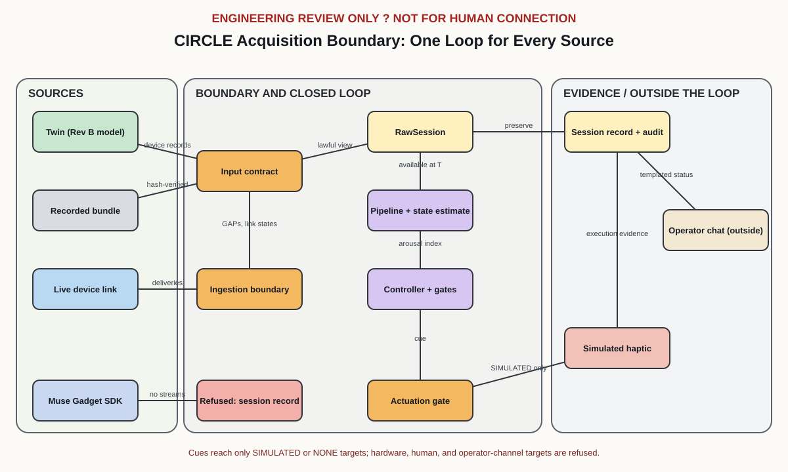

# Hardware Sources and the Muse Gadget SDK

> **ENGINEERING REVIEW ONLY** — No live device has ever been connected to CIRCLE. Everything on this page was exercised against the simulated physiology twin, recorded bundles, a simulated Muse gadget service, and, where installed, the Muse Gadget SDK's own code with no network. It establishes nothing about hardware, physiology, or people.

**CIRCLE owns the experiment. Hardware provides observations and executes bounded interventions.**

This page describes the boundary every source of device records must meet before CIRCLE's closed loop will run on it, and what Meta's [Muse Gadget SDK](https://github.com/facebookincubator/muse-gadget-sdk) can and cannot contribute through that boundary.

The short version about Muse: the Muse Gadget SDK connects devices people build (ESP32 boards, Linux computers) to **Muse, Meta's AI assistant**. It carries no physiological signal, no sample clock, no timestamps, and no sequence numbers. So it is not a biosignal source, and CIRCLE does not treat it as one. What it can honestly contribute, and what CIRCLE now uses, is smaller: a truthful capability report, a recorded refusal when it is offered as a source, an operator notification channel outside the loop, and a command set that lets the AI propose experiments but never authorize them.

---

## One loop for every source

```
                                CIRCLE
                                   │
     ┌───────────────┬─────────────┴──────┬─────────────────────┐
     │               │                    │                     │
 Simulation      Recording           Live hardware        Muse Gadget SDK
 TwinSource      RecordedSource      IngestingSource      MuseGadgetSource
 twin through    hash-verified       a device's link      no physiological
 the Rev B       raw bundle          (SimulatedLink       stream: refused,
 forward model                       in tests)            refusal recorded
     │               │                    │                     │
     └───────────────┴─────────────┬──────┴─────────────────────┘
                                   ↓
            Input contract (models/physiology/loop.py)
            eda · ppg · imu · sync, columns, descriptor constants
                                   ↓
            Observation layer: RawSession
            (sample time, availability time, declared GAPs, events)
                                   ↓
            Signal pipeline (physiology)
                                   ↓
            State estimate: arousal index (an engineering trigger)
                                   ↓
            Controller: quality gates, two-system agreement,
            clean-window precondition, hysteresis, limits
                                   ↓
            Actuation gate: SIMULATED or NONE only;
            hardware, human, and operator-channel targets refused
                                   ↓
            Intervention: command → electrical onset → IMU-observed actuation
                                   ↓
            Response measurement: later windows and evaluations
            (effect never asserted without a matched control)
                                   ↓
            Provenance and replay: session records, raw bundle,
            ledger, independent audit (REPLAY_MATCH or a named failure)

   Outside the loop:  OperatorNotifier → Muse chat (templated status, never a cue)
   Above the record:  Muse (AI) → CIRCLE command set → validate a protocol;
                      a named human authorizes on the CIRCLE host
```



The controller has always read exactly one representation, a `RawSession` of device records. The twin's session runner is now one instance of a generic loop (`run_closed_loop` in [`models/physiology/loop.py`](../models/physiology/loop.py)) that runs against any `HardwareSource`. The refactor is behavior-preserving: every exported twin artifact (session records, raw bundle, analysis, ledger, passport, scorecard, scenario results) is byte-identical to before, and the frozen scenario corpus is unchanged. Manifests gained two provenance fields: the repository commit (with whether tracked files were clean) and a SHA-256 of the run configuration.

### The boundary a source must meet

| `HardwareSource` method | Meaning |
|---|---|
| `capabilities()` | What the source can actually supply, discovered, never assumed |
| `start()` | Begin; return the device time of the first protocol marker (the schedule anchor), or `None` |
| `advance(T)` | Acquire through device time *T*; `False` when the source has nothing more |
| `view(T)` | The device records held in memory at *T* |
| `complete_through_us()` | Every sample taken at or before this time is recorded or declared lost |
| `finish()` | The complete record |

`run_closed_loop` enforces two boundaries instead of trusting callers:

- **Input contract.** Before the first evaluation the source must provide every stream the pipeline reads (`eda`, `ppg`, `imu`, `sync`), each column, and the descriptor constants the pipeline uses. A source that cannot is refused with `InsufficientEvidence`, listing every reason. Nothing missing is ever substituted, imputed, or simulated.
- **Actuation targets.** Cues may reach a `SIMULATED` actuator or none (`NONE`: decisions recorded, nothing actuated). `HARDWARE_BENCH` and `HUMAN_CONNECTED` are refused, naming the open review gates that block `POWERED_BENCH_TEST` and `HUMAN_CONNECTION` ([`hardware/review-gates.json`](../hardware/review-gates.json)); even with every gate closed, software in this repository never grants them. `OPERATOR_CHANNEL` is refused because its delivery is untimed, never physically observed, and passes through systems CIRCLE does not control. The refusal happens before anything is acquired.

The loop also stops, rather than decides, if a source could still add samples taken before the input cutoff: a decision must never rest on a record that later grows underneath it.

### Capabilities

Every source describes itself with the same record:

```json
{
  "source": "muse-gadget",
  "connected": true,
  "connection_state": "LOCAL_SERVICE_RESPONDING",
  "signals": [],
  "actuators": [{"actuator_id": "muse_chat", "target": "OPERATOR_CHANNEL", "evidence": ["DELIVERY_ACK"], "closed_loop": false}],
  "sampling": {},
  "sdk_version": "0.1.0",
  "hardware": "musegadget service at /run/musegadget/musegadget.sock",
  "authentication": "CIRCLE holds no Muse credentials. ...",
  "limitations": ["The Muse Gadget SDK provides no physiological sensing: ...", "..."]
}
```

`capability_problems()` judges a capability record against the input contract before any acquisition. The twin declares four `SIMULATED` streams and a simulated haptic actuator whose commands leave three kinds of evidence; a recording declares the streams it holds with the provenance its records state; the Muse gadget declares no streams at all.

---

## Live ingestion: what reaches the controller from a device

A live device delivers its records in pieces. [`models/acquisition/ingest.py`](../models/acquisition/ingest.py) checks each piece against the evidence rules the pipeline assumes, assembles accepted pieces into the same `RawSession` the twin produces, and makes every departure explicit:

| Departure | Handling |
|---|---|
| Malformed chunk: non-integer values, wrong or missing columns, mismatched lengths, non-increasing sequence or time, a sample available before it was taken, a code outside the converter's range, an undeclared stream | Refused and kept as a `Fault`; never repaired |
| Missing sequences, at a chunk boundary or inside a chunk | A `GAP` with the exact range: the device's own declaration when it sent one (even ahead of the samples before the loss), otherwise one the host declares (`UNDECLARED_SEQUENCE_DISCONTINUITY`) |
| Retransmitted samples | Dropped if identical to what was accepted; refused (`CONFLICTING_RETRANSMISSION`) if not |
| A chunk carrying sequences already declared lost | Refused (`CONFLICTS_DECLARED_GAP`) |
| Memory | At most `capacity` samples per stream; newer samples are lost and declared lost (`HOST_BUFFER_FULL`), the policy the MAX30102 FIFO uses |
| A burst the host cannot keep up with | `pump()` holds a bounded queue; when full, the newest chunk is dropped and declared lost on the spot with its exact range (`HOST_QUEUE_FULL`); a graceful stop drains what was received |
| A silent link | `LinkMonitor` records `LINK:LIVE`, `LINK:STALE`, `LINK:DISCONNECTED`, `LINK:RECONNECTED`, each stamped when its threshold was crossed. The silence never becomes data: the controller sees stale streams and holds (`DATA_STALE`) |
| An event that arrives after a decision needed it | Kept with its device time and flagged `LATE_EVENT` |

**Host-receipt availability.** Firmware-side, a sample is available when firmware holds it. A loop running on a host can only use what the host has received. `IngestingSource` therefore stamps availability as the later of the device's availability and the host's receipt (on the device clock). Device sample times are never changed. The consequence is the property that matters: a session that crossed a damaged link still audits as `REPLAY_MATCH`, because replaying the recorded bundle reproduces exactly what the host-side controller could see. A test shows the alternative failing: without host receipt, a late delivery rewrites what a past view held.

**What the twin over a damaged link shows** (`python tools/run_acquisition_demo.py`, seed 7):

- Over a clean link, the ingestion boundary reproduces the direct run exactly: every evaluation, every stream array, every gap and event, plus one `LINK:LIVE` event.
- With a corrupted chunk, a retransmission, an 8 s stall during the stressor, and a 6 s outage after guidance, the decisions are identical to the direct run; the six evaluations that saw impaired evidence recorded their failed quality gates; the link history and four host-declared gaps are in the session; the independent audit reports `REPLAY_MATCH`; and the exported recording replays every decision and command.
- A 14 s outage during guidance makes the loop hold on stale evidence and stop the program (`STOP_QUALITY_LOST`): a loop that cannot observe is no longer closed.
- A stream starved by its memory limit never drives a decision.

### Evidence classes stay distinct

| Class | Recorded as | Provenance |
|---|---|---|
| Raw observation | Stream samples in `raw/*.csv.gz`, bound by `STREAM_DESCRIPTOR` hashes | `RAW_MEASURED` from hardware; `SIMULATED` from the twin |
| Link observation | `EVENT` `LINK:*` (delivery health) or `LINK_STATE:*` (gadget service probe), flagged `NOT_PHYSIOLOGICAL` | as the session |
| Derived feature | `MODEL_RESULT` physiology windows; controller features | `MODEL_INFERRED`, with source ranges |
| Estimated state | `arousal_index` inside each controller evaluation | `MODEL_INFERRED` |
| Controller decision | `MODEL_RESULT` with `decision_id`, `decision_time_us`, `input_cutoff_us` | `MODEL_INFERRED` |
| Intervention | `EVENT` `HAPTIC_COMMAND` → `HAPTIC_ELECTRICAL_ONSET` → `HAPTIC_PHYSICAL_OBSERVATION` (IMU), summarized per cue by the `INTERVENTION` record's execution chain | `INTERVENTION`; the IMU observation is `DERIVED` |
| Measured response | Later physiology windows and controller evaluations; never attributed to the intervention without a matched control | `MODEL_INFERRED` |
| Operator notification | `EVENT` `OPERATOR_NOTIFICATION`, flagged `NOT_AN_INTERVENTION`, `OUTSIDE_CLOSED_LOOP`, kept beside the session | `RAW_MEASURED` (real gadget) or `SIMULATED` |
| Refused acquisition | `FAULT` per unmet input requirement; trailer `TERMINATED:INSUFFICIENT_EVIDENCE` | `DERIVED` |

---

## The Muse Gadget SDK, as it actually is

Inspected at commit [`1d2cb5a`](https://github.com/facebookincubator/muse-gadget-sdk/tree/1d2cb5af1cc3c412eedf8b08b49d3876a1eba956) (2026-10-05); Linux package `musegadget` 0.1.0. Every statement below comes from the SDK's source or documentation at that commit ([`models/muse_gadget/sdk.py`](../models/muse_gadget/sdk.py) pins the facts CIRCLE relies on).

| Question | Answer from the SDK |
|---|---|
| What it is | Device SDKs that connect a device someone builds to their Muse, Meta's AI assistant, running in a per-user cloud VM and paired through the Muse phone app |
| Platforms | **Linux device SDK** (Python 3.9+; Raspberry Pi 3B+/4/5/Zero 2 W or any Linux computer with Bluetooth LE; Debian 11+, Ubuntu 22.04+, Arch). **ESP32 device SDK** (C, ESP-IDF 6.0.1) |
| Boards | About 25 ESP32 boards: Espressif DevKits and BOX-3, M5Stack (Core2, CoreS3, StickS3, StickC Plus2, StopWatch, Cardputer ADV), Waveshare AMOLED and LCD boards, Seeed SenseCAP Indicator and Watcher, reTerminal e-paper, Home Assistant Voice, and others |
| Communication | The device opens a Noise XX–encrypted WebSocket to the Muse VM, sends `link.register` listing its commands, and answers each `link.invoke`. **Control flows from the Muse to the device.** Local programs on a Linux gadget can only post text into the Muse chat through the service's Unix socket |
| Pairing | Bluetooth LE setup with the Muse app in Developer mode; community pairing v5 (P-256 ECDH, HKDF-SHA256, AES-256-GCM). The SDK states that pairing has no manufacturer verification and cannot prevent an active man-in-the-middle |
| Data the device can hand over | Linux: shell command output, files, host health. ESP32: host health, local network discovery, camera stills (SenseCAP Watcher), push-to-talk voice (to the Muse), and on the SenseCAP Indicator **CO2, tVOC index, temperature, and humidity**, each with an integer age in seconds. All of it is requested by the Muse VM, not by local programs |
| Outputs | Screens (`display.draw_url`, `display.show_animation`), status lights, speaker volume, firmware updates; the Linux gadget runs whatever shell command the Muse sends |
| Physiological signals | **None.** No EEG, EDA, PPG, or inertial stream in either SDK |
| Timing | No device clock, no sample timestamps, no sequence numbers. Commands default to a 30 s timeout (`system.run` up to 600 s); at most 4 run concurrently; chat replies arrive asynchronously in the app |
| Failure and reconnection | The service reconnects with exponential backoff (2 s doubling to 60 s; a 15 s floor after an authorization refusal); a session that lasted 30 s resets it; device tokens rotate after about 3 hours; `link.unpaired` deletes the pairing |
| Authentication | An SDK token from gadgets.muse.ai is needed to pair. The service keeps its device tokens in `/var/lib/musegadget` (root only) and fetches a per-VM bearer for each connection. A local program needs none of them: the socket admits root and the gadget's run-as group |
| Licensing | Apache-2.0, except `minimp3.h` (CC0-1.0) and the Adafruit GFX font (BSD-2-Clause); the Jollybot avatar is not covered. Use is subject to the Gadget SDK Terms at gadgets.muse.ai |

### What CIRCLE takes from it

| Piece | Module | What it does |
|---|---|---|
| Capability discovery | `models/muse_gadget/capabilities.py` | Probes the local socket with a request the service must refuse (so nothing reaches the Muse); reports `signals: []` always, and the chat as an `OPERATOR_CHANNEL` actuator only when a service responds |
| Mapping | `models/muse_gadget/mapping.py` | Versioned (`muse-gadget-mapping/1.0.0`) statement of what maps: no measured, derived, estimated, or simulated quantity is supplied; every SDK command is classified |
| Source | `models/muse_gadget/source.py` | The gadget offered to the closed loop; refused by the input contract with five reasons; the refusal is written as an ordinary session (`tools/muse_gadget.py check`) |
| Operator notifier | `models/muse_gadget/notifier.py` | Posts a templated end-of-session status to a Muse side chat. Templates take only whitelisted passport fields; every attempt becomes a record outside the session's evidence; the closed loop refuses it as an actuator |
| Command set | `models/muse_gadget/commands.py` | `circle.capabilities` and `circle.protocol.validate`, in the SDK's command-spec format and `LinkSession` handler signature. No command can authorize, execute, actuate, read session data, or write files |
| Client and simulator | `models/muse_gadget/client.py`, `simulator.py` | The local-socket protocol with every outcome classified; a deterministic service on a real Unix socket mirroring the SDK's validation and replies |

### Mapping, in short

| CIRCLE needs | Muse Gadget SDK supplies |
|---|---|
| `measured:rev_b.eda.code` | nothing: no electrodes or ADC on any SDK board |
| `measured:rev_b.ppg.red_counts,ir_counts` | nothing: no optical front end at the skin |
| `measured:rev_b.imu.accel_gyro` | nothing: no body-worn inertial stream |
| `measured:lab.sync.pulse_index` | nothing: no sample clock or timestamps |
| `derived:physiology.hr_bpm, scl_us, scr_rate_per_min, resp_rate_bpm` | nothing: no inputs to derive them from |
| `estimated:controller.arousal_index` | nothing, and nothing is substituted |
| `simulated:twin.*` | never: a hardware adapter does not simulate |

The SenseCAP Indicator's air sensors are the only measurements in the SDK. They are environmental, not physiological, readable only by the Muse VM, and timestamped to the second, so CIRCLE does not use them.

### Safety

- **The stock Linux gadget gives the Muse a shell.** `system.run`, `file.read`, and `file.write` run as the account the gadget was installed for. On a host that can reach CIRCLE, the Muse could run `tools/run_protocol.py authorize` under any name, rewrite evidence, or edit review gates. Never install the stock gadget as an account that can read or write CIRCLE's repository or outputs, and never with sudo on such a host. CIRCLE's command set exists so that a gadget serving CIRCLE offers the Muse nothing but reading capabilities and validating proposals.
- **AI may propose; a named human authorizes.** A protocol arriving through `circle.protocol.validate` must declare `proposed_by.kind: AI_MODEL`; it is validated by the same deterministic rules as any proposal; the reply states that nothing was authorized or executed. Authorization remains `tools/run_protocol.py authorize --reviewer "Name"` on the CIRCLE host, bound to the protocol's SHA-256.
- **A chat message is not an intervention.** It goes to an AI assistant, which decides what to say; its delivery is untimed and never physically observed. The loop refuses the notifier as an actuator, and the notifier refuses `execute()` as well.
- **Serving the command set from a paired gadget is not implemented.** The handler is wire-compatible with the SDK's `LinkSession` (a conformance test runs it through a real Noise handshake), but connecting a cloud AI to a lab host is a security decision for the lab, with its own review.

### Privacy

Notification text leaves the host for Meta's Muse service and is processed by an AI assistant. Notifications are composed only from whitelisted passport fields (session identity, mode, arm, controller version, counts of evaluations and interventions, human-data status, replay status). They can carry no physiological value, participant identifier, or model-written text. `tools/muse_gadget.py notify` prints the exact message and sends nothing unless `--send` is given. CIRCLE never reads the SDK token or the pairing tokens.

### Known SDK limitations that matter here

- Whether the gadget service holds a live Muse session is visible only by sending a message (`NOT_CONNECTED` comes back if not).
- An acknowledgement (`message_id`) means the Muse service accepted a chat turn, not that a person read it.
- Messages are capped by the service at 64 KiB per request line; command output at 96 KiB per stream.
- The SDK is described by its authors as "built by hackers, for hackers, just for fun"; its interfaces may change. The mapping and tests are pinned to the inspected commit and must be re-checked after SDK updates.

---

## Running it

**Without any hardware** (what CI runs):

```bash
python tools/run_acquisition_demo.py --output outputs/acquisition-demo   # full end-to-end demonstration
python tools/muse_gadget.py capabilities --simulate                       # discovery against the simulated service
python tools/muse_gadget.py check --simulate                              # the loop refuses the gadget; refusal recorded
python tools/muse_gadget.py mapping                                       # the versioned mapping
python tools/muse_gadget.py commands                                      # the command set a CIRCLE gadget would serve
```

On a machine with no gadget, `python tools/muse_gadget.py capabilities` and `check` without `--simulate` report the real state (`LOCAL_SERVICE_ABSENT`) and record the refusal as a `LIVE` attempt.

**Tests:**

```bash
python -m unittest discover -s tests          # or: pytest
python -m unittest tests.test_closed_loop_boundary tests.test_acquisition_ingest tests.test_muse_gadget
```

**Conformance with the SDK's own code** (skipped unless the package is importable; no network, no gadget):

```bash
pip install "git+https://github.com/facebookincubator/muse-gadget-sdk@1d2cb5a#subdirectory=linux"
python -m unittest tests.test_muse_gadget_sdk_conformance
```

**Against a real gadget** (a Raspberry Pi or other Linux computer set up with the SDK's own installer, paired in the Muse app):

1. Install the gadget for a dedicated, unprivileged account that cannot reach CIRCLE's files (see Safety).
2. Add the account that runs CIRCLE to that account's group, so it can open `/run/musegadget/musegadget.sock`.
3. Run `python tools/muse_gadget.py capabilities`, then `CIRCLE_MUSE_GADGET_HARDWARE=1 python -m unittest tests.test_muse_gadget_hardware`. Add `CIRCLE_MUSE_GADGET_SEND=1` to post one test message to the side chat `circle-hardware-test`.
4. Report a finished run: `python tools/muse_gadget.py notify outputs/physiology` (prints the message), then add `--send`.

### Bringing your own recording

`RecordedSource` replays any directory in CIRCLE's bundle format: `session.ndjson` (contract-valid records with stream descriptors, controller configuration, device events, and gaps) plus `raw/<stream>.csv.gz` with integer columns `sequence, device_time_us, available_us,` and the stream's code columns. Each stream's content must match the SHA-256 bound in its descriptor, or the recording is refused. CIRCLE ships no human recordings; recordings of people stay with the researcher and their ethics approval.

---

## What this does not show

- No live device, transport, or clock mapping has been built or measured. The ingestion boundary has seen only the twin over a scripted link and recorded bundles; real links fail in ways not modeled here.
- The Muse adapter has never talked to a paired gadget or to Meta's service. It was checked against the simulator and, where installed, against the SDK's own service and `LinkSession` code with no network.
- Nothing here changes what CIRCLE claims about physiology: every signal is still simulated, the arousal index is still an engineering trigger, and no intervention effect is asserted without a matched control.

### If an EEG headband was meant

EEG headbands sold under the Muse name are a different product with a different SDK, and this one does not include them. Even with such a device, CIRCLE's controller would not use it directly: its trigger requires agreement between cardiovascular and electrodermal evidence, and EEG provides neither. A new source would enter through the same input contract, and a new stream would need its own pipeline features and a reviewed controller policy, validated first against simulation with known truth.
