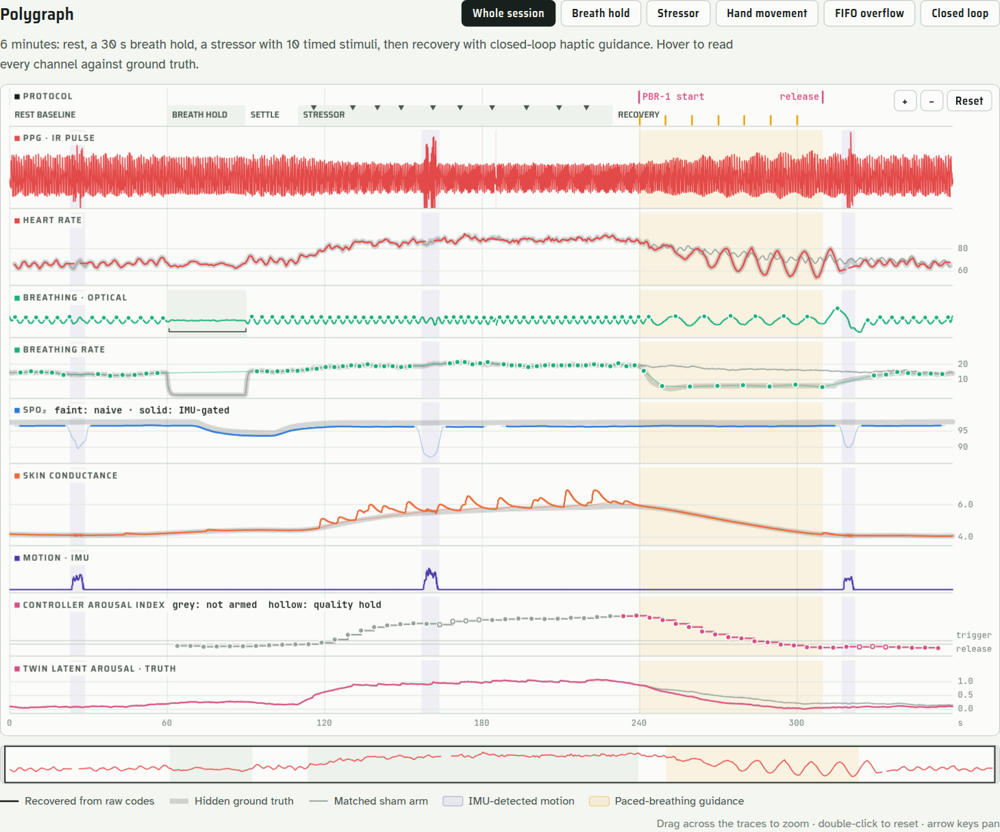
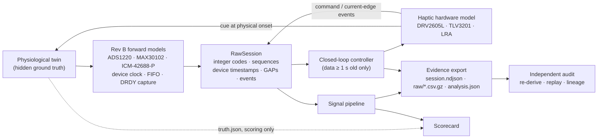

# Physiology Twin, Signal Pipeline, and Closed-Loop Evidence

> **ENGINEERING REVIEW ONLY** — Every signal described here is simulated. Nothing in this module drives hardware or involves a person. Agreement with the twin tests the software's measurement, timing, and evidence logic; it does not establish physiological, clinical, or hardware accuracy.

CIRCLE exists to capture EDA, PPG, and IMU signals and to study how they move together. This module is the software that turns those raw Rev B codes into physiology. Because no hardware has been built, it is exercised against a **physiological twin**: a seeded model whose ground truth is known, rendered through faithful models of the Rev B sensors and firmware timing. Each estimate can then be scored, each closed-loop decision replayed, and each piece of evidence audited.



## Run it

```bash
# One 6-minute closed-loop session: export, score against truth, audit independently (~8 s)
python tools/run_physiology_twin.py --seed 7 --output outputs/physiology --audit

# Audit any exported run directory without re-running the simulation
python tools/audit_physiology_run.py outputs/physiology

# Score many sessions (seeds 100-149 were held out during development)
python tools/run_physiology_twin.py --benchmark 50

# Matched arms: decisions logged, cues never actuated
python tools/run_physiology_twin.py --sham --output outputs/physiology-sham
```

Open `outputs/physiology/report.html` in a browser. An example is committed at [`diagrams/circle-physiology-session.html`](../diagrams/circle-physiology-session.html).

## Architecture



The pipeline and controller import nothing from the twin. Their only input is a `RawSession`: exactly what the firmware would have written. A causality guard fails the run if the controller could see any sample the device had not yet recorded at decision time.

## The twin

Each mechanism is a simplified, published model. The twin is phenomenological; its parameters are plausible, not fitted to any person.

| Mechanism | Model | Reference |
|---|---|---|
| Latent arousal | First-order tracking of a protocol drive (rise 12 s, decay 40 s) with diffusion noise | — |
| Heartbeats | Integral pulse frequency modulation of HR = rest + arousal gain + RSA + 0.095 Hz Mayer wave + OU noise | Rompelman 1977; Mateo & Laguna 2000 |
| RSA | Amplitude falls with arousal and rises sharply near 0.1 Hz breathing | Lehrer & Gevirtz 2014 |
| Pulse wave | Asymmetric systolic wave plus dicrotic wave one pulse arrival time after each beat; arousal shortens PAT and lowers amplitude (vasoconstriction) | — |
| Skin conductance | Tonic level tracking arousal; SCRs as Bateman bi-exponentials, spontaneous (rate rises with arousal) and stimulus-locked (1.4–2.2 s latency) | Benedek & Kaernbach 2010 |
| SpO₂ | First-order oxygen store with 11 s circulatory delay; the breath hold produces a delayed 3.4-point desaturation | — |
| Motion | Band-limited limb motion (0.8–4 Hz), a posture shift, 9.5 Hz tremor; coupled into PPG intensity and EDA electrode contact | — |
| Paced breathing | Cues entrain breathing toward 6/min with a phase-coupling term; entrainment speeds arousal decay. **This response is an assumption of the twin.** | — |

The protocol runs 360 s: rest (60 s), breath hold (30 s), settle (20 s), mental-arithmetic stressor with timed stimuli (120 s), recovery with closed-loop guidance (130 s). Three motion episodes and one PPG FIFO overflow are scripted.

All randomness is drawn up front per grid step, per beat, and per stimulus. An active arm and a sham arm with the same seed are therefore identical until the first cue reaches the body. The sham arm is a true counterfactual, and a test enforces this.

## Rev B hardware and firmware models

| Stream | Model | Source |
|---|---|---|
| EDA | ADS1220, 24-bit, PGA 4, REF5020 2.048 V. Four-wire path with 0.500 V excitation through the 4 × 49.9 kΩ limit network; the ADC senses the limit-network voltage. Timer-triggered single-shot conversions at 64 Hz (11.2 ms at the 90 SPS setting), DRDY edge captured. | Architecture, bring-up plan; single-shot timing is an assumption |
| PPG | MAX30102 red 660 nm / IR 880 nm, 18-bit, 100 SPS from the sensor's own oscillator (−3500 ppm assumed), 32-sample FIFO, almost-full interrupt at 16, rollover disabled | Firmware init guide; oscillator error assumed |
| IMU | ICM-42688-P, 400 SPS (+1100 ppm assumed), ±4 g / ±500 dps, 16-bit, DRDY captured | Firmware init guide |
| Device clock | 1 µs monotonic timer, +23.7 ppm, boot offset 7.316 s | Timing doc; drift assumed |
| Edge capture | Latency 1.5 µs + Exp(1.2 µs), bounded at 25 µs | Assumption sized to the validation plan |
| SYNC | Isolated SYNC_IN capture of a laboratory 1 PPS reference | Architecture |
| Haptic | DRV2605L GO → TLV3201 current edge on GPIO46 (~0.28 ms) → 170 Hz LRA vibration with a 4 ms rise, felt at the wrist IMU | Pin map; latencies assumed |

**PPG timestamps** are reconstructed the way firmware should do it. Each almost-full interrupt edge is hardware-captured and anchors the sample that raised it. A running estimate of the sensor's true sample period (from successive anchors) spaces the others. `OVF_COUNTER` supplies the exact number of samples lost during a stall, so sequence numbers stay aligned with the sensor clock and the loss becomes an exact `GAP` record.

## Signal pipeline

| Channel | Method |
|---|---|
| Clock | Least-squares device-time vs 1 PPS fit (recovers drift to < 0.001 ppm) |
| IMU | Gravity by 0.4 Hz low-pass; dynamic-acceleration RMS and gyro RMS thresholds; episodes dilated 0.75 s |
| Haptic onset | Second difference removes gravity and limb motion. For a sinusoid of known frequency, two consecutive samples fix its amplitude: A² = (x₀² + x₁² − 2x₀x₁ cos ω) / sin² ω. Onset is the 50 % crossing of that envelope. |
| EDA | Code → conductance through the front-end equation. Gaussian smoothing (−3 dB at 1.2 Hz) avoids the Gibbs ringing a sharp FIR puts in front of each response. SCRs are transient bumps in slope above the recovering baseline (exponential recovery, τ = 3 s). Onset is at maximum curvature; amplitude is the bump's area. Tonic level comes from inter-response anchors. |
| PPG beats | IR, 0.5–8 Hz linear-phase band-pass; two event-related moving averages (Elgendi et al. 2013); fiducial refined on a 15 Hz low-pass; template-correlation quality; IBIs screened physiologically |
| HR / HRV | Instantaneous HR from valid IBIs; RMSSD over successive valid pairs |
| Breathing | Respiratory-induced intensity variation (IR baseline). Breaths by topographic prominence. Apnea is envelope collapse (< 25 % of median for ≥ 10 s), so slow paced breathing is never mistaken for apnea. Intervals never cross a sequence gap. |
| SpO₂ | Ratio of ratios on 4 s windows with the uncalibrated curve 110 − 25 R. Gated on IMU motion, segment edges, perfusion, and red/IR correlation. The twin's tissue optics deliberately differ from that curve, so the score carries a realistic ~1-point calibration bias instead of rewarding an inverse crime. |

Every 10 s window becomes a `MODEL_RESULT` record whose `source_sequence_ranges` name the exact EDA, PPG, and IMU samples used. Ranges split around declared gaps.

## Closed-loop controller

Every 5 s (device clock) the controller reads samples from the 40 s window ending 1 s before the decision time:

- **Arousal index** = 0.45 z(HR) + 0.35 z(SCL) + 0.20 z(SCR rate), with z-scores against the rest phase and conservative SD floors. It is an engineering trigger, not a psychological measure.
- **Quality gate**: beat coverage ≥ 70 % and motion ≤ 20 % of the window; otherwise the evaluation is a `HOLD_QUALITY`.
- **Policy**: armed at the recovery marker. Two consecutive indices ≥ 2.0 start paced breathing (one haptic cue every 10 s). After ≥ 60 s, two consecutive indices < 1.0 release it (hysteresis), otherwise it stops at 150 s. A 60 s refractory period follows.

Each evaluation is a pure function of recorded samples, protocol markers logged before it, and the controller's own earlier state. `controller.replay()` re-derives every decision from the exported bundle. The audit requires bit-identical agreement, and a test shows that rewriting samples newer than the decision margin cannot change a decision.

## Evidence

A run directory is self-auditing:

| File | Contents |
|---|---|
| `session.ndjson` | Contract-valid session ([`session-record.schema.json`](../contracts/session-record.schema.json)): header, stream descriptors (with raw-content SHA-256), controller configuration, clock mapping, protocol and haptic events, the FIFO `GAP`, windowed and per-evaluation `MODEL_RESULT`s with lineage, IMU-observed physical onsets, `INTERVENTION`s, trailer |
| `raw/*.csv.gz` | Integer codes, sequence numbers, device timestamps (deterministic gzip). The JSON profile carries one snapshot per record, so multi-sample data lives here, bound by hash. |
| `analysis.json` | Every pipeline output, re-derivable from `raw/` |
| `truth.json`, `scorecard.json` | Hidden ground truth and the scores; never pipeline input |
| `counterfactual.json` | The matched opposite arm's truth and decisions |
| `report.html` | Self-contained interactive polygraph |
| `manifest.json` | SHA-256 of every artifact, configuration, versions, replay result. No wall-clock time: two runs produce byte-identical directories. |

Every record carries `SIMULATED`, `DERIVED`, `MODEL_INFERRED`, or `INTERVENTION` provenance, never `RAW_MEASURED`. Each `INTERVENTION` names its `decision_id` and lists the command events, TLV3201 current-edge events, and IMU physical-observation records as `actuation_evidence_ids`. Together they satisfy the timing document's requirement that command, electrical onset, physical observation, and completion be distinct, measured events.

`tools/audit_physiology_run.py` trusts nothing it did not recompute:

1. Artifact hashes match the manifest.
2. The session passes the schema, CRC-32C, and semantic auditor (`models.session_records`).
3. Raw file contents match the hashes bound in the stream descriptors.
4. Recorded model artifact ids match the current analysis source code.
5. The full pipeline re-run on `raw/` reproduces `analysis.json` exactly.
6. Replaying the controller reproduces every evaluation record and cue command.
7. Every source range lies on recorded samples and never spans a gap.
8. Every intervention's evidence ids resolve to recorded events, and its decision to a recorded `MODEL_RESULT`.

Tests confirm that changing one raw sample, or rewriting a decision's payload with a freshly computed valid CRC, makes the audit fail. CRC-32C and SHA-256 detect accidental or inconsistent change; they are not authentication.

## Scoring conventions

- Pipeline device times are mapped to laboratory time with the pipeline's own SYNC fit, never the hidden clock truth.
- **Beats**: the truth fiducial is the observable systolic maximum; tolerance ±50 ms; one-to-one matching; samples near declared gaps and session edges are excluded; motion-free statistics are reported separately.
- **SCRs**: tolerance ±1 s on onset. Two true responses fuse when one begins on the other's rising limb or within 0.5 s of its peak (below the 1.2 Hz analysis bandwidth). Fused responses do not count as misses, but any true response may confirm a detection. Responses overlapping motion are excluded because the pipeline withholds them.
- `SPEC` targets come from CIRCLE documents (timing, validation plan). `TWIN` targets are software regression targets for this simulation.

## Held-out benchmark

Seeds 100–149 were not used while developing the methods. Reproduce with `python tools/run_physiology_twin.py --benchmark 50`; results are in [`physiology-benchmark.json`](physiology-benchmark.json).

| Check | Target | Mean | Worst | Pass |
|---|---|---|---|---|
| SYNC clock-rate error | ≤ 0.1 ppm | 0.0001 | 0.0002 | 100 % |
| EDA/IMU edge timestamp P99.9 (spec) | ≤ 10 µs | 9.54 | 9.73 | 100 % |
| EDA/IMU edge timestamp max (spec) | ≤ 25 µs | 16.1 | 21.6 | 100 % |
| PPG FIFO timestamp max (spec) | ≤ 1000 µs | 553 | 557 | 100 % |
| Declared GAP equals true loss (spec) | exact | yes | yes | 100 % |
| PPG beat F1, motion-free | ≥ 0.99 | 0.9999 | 0.9988 | 100 % |
| PPG beat F1, all | ≥ 0.95 | 0.976 | 0.965 | 100 % |
| Heart rate MAE | ≤ 1.0 bpm | 0.39 | 0.44 | 100 % |
| RMSSD MAE (60 s) | ≤ 5 ms | 1.50 | 2.16 | 100 % |
| Breathing rate MAE | ≤ 1.0 /min | 0.36 | 0.49 | 100 % |
| Breath-hold IoU | ≥ 0.85 | 0.981 | 0.960 | 100 % |
| SpO₂ MAE, gated (incl. calibration bias) | ≤ 2.0 % | 1.15 | 1.17 | 100 % |
| False desaturation windows, gated | 0 | 0 | 0 | 100 % |
| SCR sensitivity | ≥ 0.85 | 0.981 | 0.786 | 98 % |
| SCR positive predictive value | ≥ 0.90 | 1.000 | 1.000 | 100 % |
| SCR amplitude error (median, relative) | ≤ 15 % | 4.3 % | 8.6 % | 100 % |
| Tonic conductance MAE | ≤ 0.10 µS | 0.035 | 0.063 | 100 % |
| Motion episode IoU | ≥ 0.60 | 0.718 | 0.707 | 100 % |
| IMU-observed haptic onset error, max | ≤ 5 ms | 2.71 | 2.97 | 100 % |
| Arousal index vs latent truth (r) | ≥ 0.85 | 0.919 | 0.887 | 100 % |

999 of 1000 checks pass. The failure is SCR sensitivity on seed 147 (11 of 14). Two missed responses began 0.66 s and 0.82 s after the preceding response's peak and were merged with it; the third was a 0.052 µS response on the steepest part of a 0.53 µS recovery. These are the method's resolution limits, reported as measured rather than tuned away. The EDA/IMU P99.9 values sit just under 10 µs because they reflect the assumed capture-latency distribution; they test the timestamping logic, not the hardware's interrupt latency.

## Findings for the Rev B design review

The twin surfaced issues that matter for real firmware:

1. **ADS1220 has no 64 SPS mode.** Its continuous data rates are 20/45/90/175… SPS (normal mode). The 64 SPS in the [firmware guide](firmware-pinmap-and-init.md) needs timer-triggered single-shot conversions (as modeled here, 11.2 ms at the 90 SPS setting) or a native rate. A single-shot sample's timestamp is its DRDY edge, about half a conversion (5.6 ms) after the sample's effective center; the stream descriptor records this offset and the pipeline removes it.
2. **PPG timestamps must anchor on the FIFO interrupt, not the read.** After an overflow the buffered samples are older than the read by the number of lost samples times the period (230 ms in this session). Stamping by read time would shift a whole batch of beats. Anchoring on the captured almost-full edge and tracking the sensor's period keeps every sample within 0.56 ms here, inside the 1 ms bound.
3. **FIFO stalls have an observability limit.** `OVF_COUNTER` saturates at 31. With a 16-sample threshold at 100 SPS, a stall longer than about 0.46 s loses a number of samples the firmware cannot know, and exact `GAP` records become impossible. The rig refuses such configurations; firmware should service the FIFO well within that budget.
4. **The wrist IMU can measure haptic physical onset.** At 400 SPS it resolves command-to-vibration latency to within about ±3 ms of truth with no extra sensor. That offers a practical route to the "measured command-to-physical latency" the timing document requires.
5. **Motion gating is not optional for SpO₂.** Motion changes red and IR intensity by the same fraction, pushing the ratio toward 1. Naive SpO₂ falls to about 87 % during hand movement, which would trigger false desaturation alarms. IMU gating removes all of them in every benchmark seed.

## Limitations

- All signals are simulated by a phenomenological twin. Scores measure internal consistency against that model, not physiology, calibration, or clinical accuracy.
- The paced-breathing response is assumed. The counterfactual shows that the evidence chain can resolve such an effect, not that the effect exists.
- SpO₂ uses an uncalibrated empirical curve and reads about 1 point low by design.
- Sensor oscillator errors, capture latencies, and haptic latencies are assumptions until measured on hardware.
- The arousal index is an engineering trigger; physiological signals must never be read as direct measures of mental states.

## References

- Benedek, M. & Kaernbach, C. (2010). A continuous measure of phasic electrodermal activity. *J. Neurosci. Methods* 190(1).
- Boucsein, W. et al. (2012). Publication recommendations for electrodermal measurements. *Psychophysiology* 49(8).
- Elgendi, M. et al. (2013). Systolic peak detection in acceleration photoplethysmograms measured from emergency responders in tropical conditions. *PLoS ONE* 8(10).
- Lehrer, P. & Gevirtz, R. (2014). Heart rate variability biofeedback: how and why does it work? *Frontiers in Psychology* 5.
- Mateo, J. & Laguna, P. (2000). Improved heart rate variability signal analysis from the beat occurrence times according to the IPFM model. *IEEE TBME* 47(8).
- Phipson, B. & Smyth, G. K. (2010). Permutation p-values should never be zero. *Stat. Appl. Genet. Mol. Biol.* 9(1).
- Rompelman, O. et al. (1977). Measurement of heart-rate variability: Part 1 — comparative study of heart-rate variability analysis methods. *Med. Biol. Eng. Comput.* 15.
